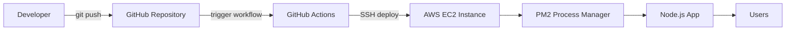
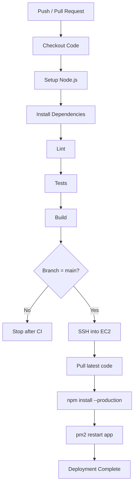
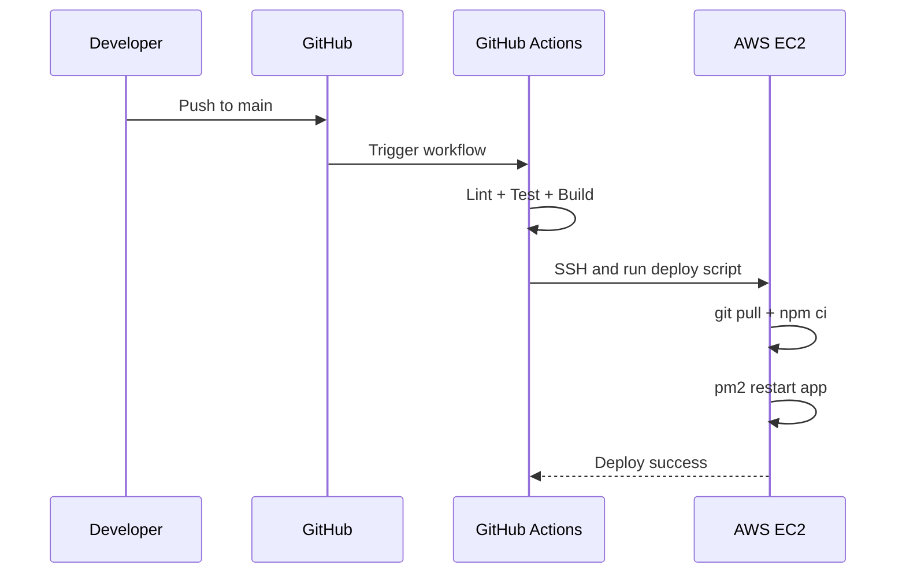

# CI/CD with GitHub Actions (Node.js + AWS EC2)

This guide is focused on **practicing CI/CD for a Node.js app deployed on AWS EC2**.

## What is CI/CD?

- **CI (Continuous Integration):** Auto-build + auto-test on every push/PR.
- **CD (Continuous Deployment/Delivery):** Auto-deploy after CI passes.

## High-Level Architecture



## End-to-End Pipeline Flow



## CI vs CD

| CI | CD |
| --- | --- |
| Build + test automatically | Deploy automatically/manual approval |
| Runs on push/PR | Runs after CI success |
| Focus: code quality | Focus: release automation |

## Folder Structure

```text
.github/
  workflows/
    ci-cd.yml
```

## GitHub Actions Workflow (Node.js + EC2 Deploy)

Create `.github/workflows/ci-cd.yml`:

```yaml
name: Node.js CI-CD to EC2

on:
  push:
    branches: ["main"]
  pull_request:
    branches: ["main"]
  workflow_dispatch:

jobs:
  ci:
    runs-on: ubuntu-latest

    steps:
      - name: Checkout code
        uses: actions/checkout@v4

      - name: Setup Node.js
        uses: actions/setup-node@v4
        with:
          node-version: 20
          cache: npm

      - name: Install dependencies
        run: npm ci

      - name: Lint
        run: npm run lint --if-present

      - name: Test
        run: npm test --if-present

      - name: Build
        run: npm run build --if-present

  cd:
    runs-on: ubuntu-latest
    needs: ci
    if: github.ref == 'refs/heads/main' && github.event_name == 'push'

    steps:
      - name: Deploy to EC2 via SSH
        uses: appleboy/ssh-action@v1.0.3
        with:
          host: ${{ secrets.EC2_HOST }}
          username: ${{ secrets.EC2_USER }}
          key: ${{ secrets.EC2_SSH_KEY }}
          script: |
            cd /var/www/my-node-app
            git pull origin main
            npm ci --omit=dev
            pm2 restart app || pm2 start index.js --name app
            pm2 save
```


## Required GitHub Secrets

Add these in: **Repo Settings -> Secrets and variables -> Actions**

- `EC2_HOST` (example: `13.233.xx.xx`)
- `EC2_USER` (example: `ubuntu`)
- `EC2_SSH_KEY` (private key content)

## EC2 One-Time Server Setup

Run on EC2:

```bash
sudo apt update
sudo apt install -y git curl
curl -fsSL https://deb.nodesource.com/setup_20.x | sudo -E bash -
sudo apt install -y nodejs
sudo npm install -g pm2

mkdir -p /var/www/my-node-app
cd /var/www/my-node-app
# first-time clone
# git clone <your-repo-url> .
# npm install
# pm2 start index.js --name app
# pm2 save
```

## Deployment Sequence Diagram



## Best Practices

- Keep CI and CD as separate jobs.
- Use `branch protection` on `main`.
- Never hardcode keys in workflow files.
- Use PM2 for zero-downtime style restarts.
- Add health check after deploy.
- Keep rollback ready (previous commit tag).

## Quick Summary

Your Node.js + EC2 CI/CD pipeline should be:

`Push -> CI (lint/test/build) -> SSH Deploy to EC2 -> PM2 Restart`
