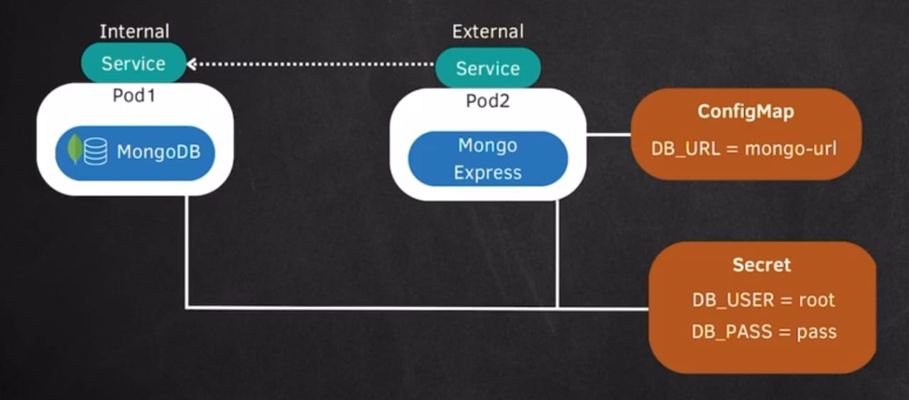

# MongoDB on Kubernetes (Practical Steps)

This guide is for hands-on practice.  
You will run the commands yourself in order.

## Flow
1. Create Secret  
2. Create Deployment for MongoDB  
3. Create Internal Service for MongoDB    
4. Create ConfigMap  
5. Create Deployment for Mongo Express  
6. Create External Service for Mongo Express  


---

## 1) Create Secret

Store MongoDB username/password securely.

Why base64 command is used:
```bash
echo -n "root" | base64
```
- Kubernetes `Secret` values under `data:` must be base64-encoded.
- `-n` avoids adding a newline character in the encoded value.
- This helps create correct secret values for deployment environment variables.

Example `mongodb-secret.yaml`:
```yaml
apiVersion: v1
kind: Secret
metadata:
  name: mongodb-secret
type: Opaque
data:
  mongo-root-username: bW9uZ29hZG1pbg==   # mongoadmin
  mongo-root-password: cGFzc3dvcmQ=       # password
```

Note:
- Base64 is encoding, not encryption.
- You can use `stringData:` to write plain text and let Kubernetes encode it automatically.

Apply:
```bash
kubectl apply -f mongodb-secret.yaml
kubectl get secret
```

---

## 2) Create Deployment for MongoDB

Use secret values as environment variables.

Example `mongodb-deployment.yaml`:
```yaml
apiVersion: apps/v1
kind: Deployment
metadata:
  name: mongodb-deployment
  labels:
    app: mongodb
spec:
  replicas: 1
  selector:
    matchLabels:
      app: mongodb
  template:
    metadata:
      labels:
        app: mongodb
    spec:
      containers:
        - name: mongodb
          image: mongo:6
          ports:
            - containerPort: 27017
          env:
            - name: MONGO_INITDB_ROOT_USERNAME
              valueFrom:
                secretKeyRef:
                  name: mongodb-secret
                  key: mongo-root-username
            - name: MONGO_INITDB_ROOT_PASSWORD
              valueFrom:
                secretKeyRef:
                  name: mongodb-secret
                  key: mongo-root-password
```

Apply:
```bash
kubectl apply -f mongodb-deployment.yaml
kubectl get deployments
kubectl get pods
```

---

## 3) Create Internal Service for MongoDB

Mongo Express will use this service name to connect to MongoDB.

Example `mongodb-service.yaml`:
```yaml
apiVersion: v1
kind: Service
metadata:
  name: mongodb-service
spec:
  selector:
    app: mongodb
  ports:
    - protocol: TCP
      port: 27017
      targetPort: 27017
  type: ClusterIP
```

Apply:
```bash
kubectl apply -f mongodb-service.yaml
kubectl get svc
```

---

## 4) Create ConfigMap

Store non-sensitive config for Mongo Express.

Example `mongodb-configmap.yaml`:
```yaml
apiVersion: v1
kind: ConfigMap
metadata:
  name: mongodb-configmap
data:
  database_url: mongodb-service
```

Apply:
```bash
kubectl apply -f mongodb-configmap.yaml
kubectl get configmap
```

---

## 5) Create Deployment for Mongo Express

Use:
- username/password from Secret
- database service URL from ConfigMap

Example `mongo-express-deployment.yaml`:
```yaml
apiVersion: apps/v1
kind: Deployment
metadata:
  name: mongo-express-deployment
  labels:
    app: mongo-express
spec:
  replicas: 1
  selector:
    matchLabels:
      app: mongo-express
  template:
    metadata:
      labels:
        app: mongo-express
    spec:
      containers:
        - name: mongo-express
          image: mongo-express:latest
          ports:
            - containerPort: 8081
          env:
            - name: ME_CONFIG_MONGODB_ADMINUSERNAME
              valueFrom:
                secretKeyRef:
                  name: mongodb-secret
                  key: mongo-root-username
            - name: ME_CONFIG_MONGODB_ADMINPASSWORD
              valueFrom:
                secretKeyRef:
                  name: mongodb-secret
                  key: mongo-root-password
            - name: ME_CONFIG_MONGODB_SERVER
              valueFrom:
                configMapKeyRef:
                  name: mongodb-configmap
                  key: database_url
```

Apply:
```bash
kubectl apply -f mongo-express-deployment.yaml
kubectl get pods
```

---

## 6) Create External Service for Mongo Express

Expose Mongo Express in browser.

Example `mongo-express-service.yaml`:
```yaml
apiVersion: v1
kind: Service
metadata:
  name: mongo-express-service
spec:
  selector:
    app: mongo-express
  ports:
    - protocol: TCP
      port: 8081
      targetPort: 8081
      nodePort: 30081
  type: NodePort
```

Apply:
```bash
kubectl apply -f mongo-express-service.yaml
kubectl get svc
```

For Minikube:
```bash
minikube service mongo-express-service --url
```

---

## Verification Commands

```bash
kubectl get all
kubectl get secret
kubectl get configmap
kubectl logs deployment/mongo-express-deployment
kubectl logs deployment/mongodb-deployment
```

## Cleanup (optional)
```bash
kubectl delete -f mongo-express-service.yaml
kubectl delete -f mongo-express-deployment.yaml
kubectl delete -f mongodb-configmap.yaml
kubectl delete -f mongodb-service.yaml
kubectl delete -f mongodb-deployment.yaml
kubectl delete -f mongodb-secret.yaml
```
