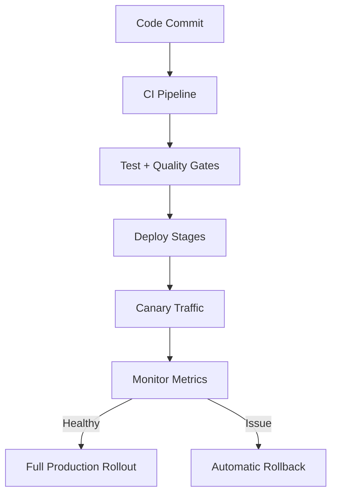

# Netflix Microservices Architecture (English + Hinglish)

## Intro

**English:**
Netflix runs on a large microservices architecture, not a single monolithic application. Each service owns a specific business function (like auth, recommendation, playback, billing), and services are independently deployable and scalable.

**Hinglish:**
Netflix ek single monolithic app nahi chalata. Ye bahut saare microservices pe based hai, jahan har service ka apna specific kaam hota hai (auth, recommendation, playback, billing), aur har service ko alag se deploy/scale kiya ja sakta hai.

---

## Monolith vs Microservices

| Monolith | Microservices |
| --- | --- |
| Single codebase | Multiple small services |
| One deployment unit | Independent deployments |
| Hard to scale specific feature | Scale only required service |
| Failure can impact whole app | Better failure isolation |

**English:**
Microservices improve team ownership, release speed, and scalability.

**Hinglish:**
Microservices se team ownership better hoti hai, release fast hota hai, aur scaling easy ho jati hai.

---

## High-Level Netflix Architecture

## Horizontal Architecture View (Layered)

**English (Flow):**
1. User request hits API Gateway.
2. Gateway routes request to required microservices.
3. Services collaborate and return response.
4. Video is delivered through CDN/Open Connect for low-latency streaming.

**Hinglish (Flow):**
1. User ka request pehle API Gateway pe aata hai.
2. Gateway request ko sahi microservices tak bhejta hai.
3. Services milkar response banati hain.
4. Video mostly CDN/Open Connect se stream hota hai for fast playback.

---

## Key Microservice Domains

1. Identity & Access
2. User Profile
3. Catalog/Metadata
4. Recommendation/Personalization
5. Playback Orchestration
6. Billing & Subscription
7. Search
8. Notifications
9. Analytics/Event Pipeline

**English:**
Netflix organizes functionality into domain-based services so each domain can evolve independently.

**Hinglish:**
Netflix features ko domain-based services mein todta hai, taaki har domain independently improve ho sake.

---

## Platform Patterns Used in Netflix-Style Systems

## 1) API Gateway
**English:** Single entry point for clients.  
**Hinglish:** Client ke liye ek single front gate.

## 2) Service Discovery
**English:** Dynamically finds service instances in a changing environment.  
**Hinglish:** Auto-scale environment mein service instances ko automatically locate karta hai.

## 3) Load Balancing
**English:** Distributes requests across multiple instances.  
**Hinglish:** Traffic ko multiple instances mein balance karta hai.

## 4) Circuit Breaker
**English:** Prevents cascading failures when downstream service is unhealthy.  
**Hinglish:** Agar downstream service fail ho rahi ho to repeated calls rok deta hai.

## 5) Centralized Configuration
**English:** Manage runtime configs centrally.  
**Hinglish:** Config ek jagah se manage hota hai.

## 6) Observability
**English:** Metrics + logs + traces + alerts for production monitoring.  
**Hinglish:** Metrics, logs, tracing, alerts ke bina distributed system debug karna mushkil hai.

---

## Data Layer at Netflix Scale

**English:**
Large-scale microservices usually use polyglot persistence (different storage systems for different workloads): cache, NoSQL, event streams, analytics systems.

**Hinglish:**
Netflix-level scale par ek hi DB enough nahi hota. Workload ke hisaab se alag systems use hote hain: cache, NoSQL, event stream, analytics.

Commonly known tech in Netflix ecosystem context:
- Cassandra
- Kafka
- EVCache
- Dynomite

---

## Deployment and Reliability Mindset

**English:**
Netflix-style delivery emphasizes small frequent releases, canary deployments, strong monitoring, and fast rollback.

**Hinglish:**
Netflix style deployment mein chhote frequent releases, canary rollout, strong monitoring aur quick rollback pe focus hota hai.

---

## Why Netflix Uses Microservices

**English:**
- Massive scale handling
- Independent teams and ownership
- Faster release cycles
- Better fault isolation
- Service-level optimization

**Hinglish:**
- Bohot large scale ko handle karna
- Teams independently kaam kar sakein
- Releases fast ho
- Ek service fail ho to poora system na gire
- Har service ka targeted optimization ho

---

## Challenges

**English:**
Microservices increase distributed-system complexity: networking, debugging, monitoring, and consistency concerns.

**Hinglish:**
Microservices powerful hain, but complexity badh jati hai: network calls, debugging, monitoring aur consistency issues.

---

## Quick Revision Notes

1. Netflix = microservices + cloud-native + automation.
2. API Gateway + discovery + resilience patterns are core.
3. CDN/Open Connect is key for streaming performance.
4. Recommendation and data platform drive personalization.
5. Reliability depends on observability + canary + rollback.
