# Kubernetes and Microservices

## What is Kubernetes?
Kubernetes (K8s) is an open-source container orchestration platform.
It helps manage, deploy, scale, and monitor containerized applications automatically.

## Kubernetes at a Glance (Diagram)
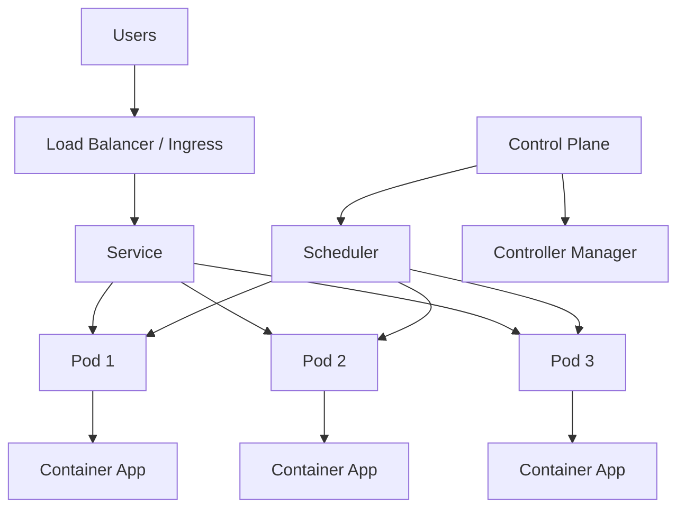


## Why use Kubernetes?
- Automates deployment and scaling
- Self-healing (restarts failed containers)
- Load balances traffic across containers
- Supports rolling updates and rollbacks
- Works well in cloud and on-prem environments

## What are Microservices?
Microservices is an architecture style where an application is split into many small, independent services.
Each service handles one business function and can be developed, deployed, and scaled separately.

## Microservices Diagram
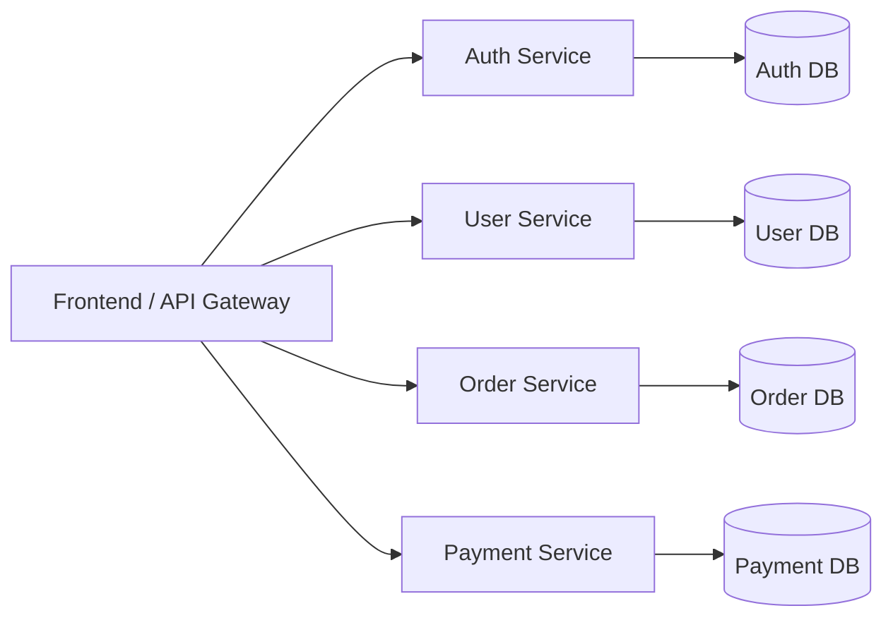

## Monolith vs Microservices (Quick View)
| Monolith | Microservices |
| --- | --- |
| Single large application | Many small services |
| One codebase/deployment | Separate services/deployments |
| Harder to scale specific parts | Scale each service independently |
| Tightly coupled | Loosely coupled |

## How Kubernetes and Microservices work together
Kubernetes is commonly used to run microservices in containers.
It manages service discovery, scaling, health checks, and deployment lifecycle for each service.

## Kubernetes + Microservices (Combined Diagram)
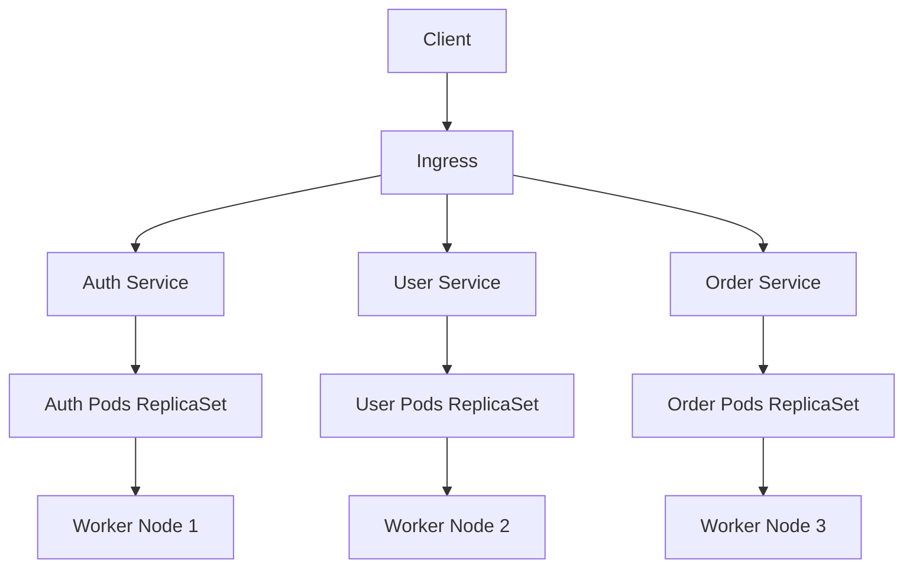

## Container Orchestration

Container orchestration means managing many containers automatically in production.
Instead of manually starting/stopping containers, an orchestrator handles deployment, scaling, networking, and recovery.

## Why it is needed
- Applications run in multiple containers
- Manual management becomes hard at scale
- Need high availability and auto-recovery
- Need rolling updates with minimal downtime

## Common Orchestration Tasks
- Scheduling containers on available servers
- Auto-scaling up/down based on load
- Service discovery and load balancing
- Self-healing (restart failed containers)
- Rolling updates and rollbacks
- Secret/config management

## Container Orchestration Diagram
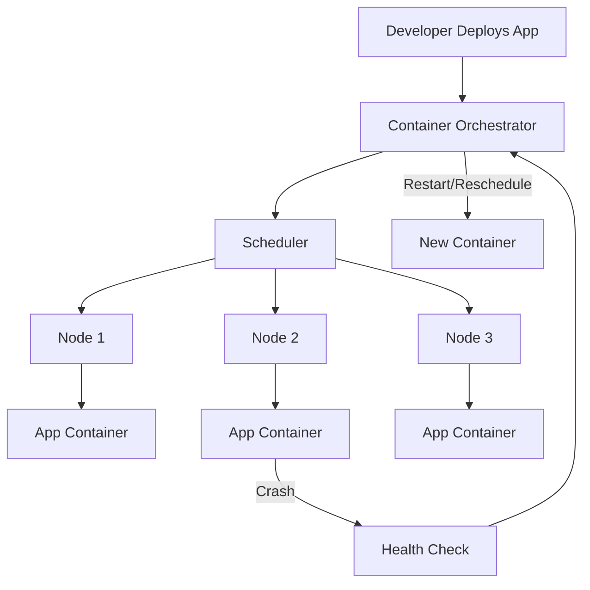

## Kubernetes as an Orchestrator
Kubernetes is the most popular container orchestrator.
It ensures your desired state is maintained automatically.

## Components of Kubernetes (K8s)

## 1) API Server
- Entry point of Kubernetes control plane.
- Receives all requests from `kubectl`, UI, and internal components.
- Validates and processes cluster operations.

## 2) ETCD
- Distributed key-value store used by Kubernetes.
- Stores cluster state, configurations, and metadata.
- Source of truth for Kubernetes data.

## 3) Scheduler
- Decides which worker node should run a new Pod.
- Selects node based on resources, policies, and constraints.

## 4) Kube Controller Manager (Kube Controller)
- Runs controllers that continuously check desired state vs actual state.
- Examples: Node Controller, Replication Controller, Endpoint Controller.
- Ensures cluster self-healing and reconciliation.

## 5) Kubelet
- Agent running on every worker node.
- Communicates with API Server.
- Ensures Pod containers are running as defined.

## 6) Kube Proxy
- Network component on each node.
- Handles service networking and load balancing inside cluster.
- Maintains networking rules for Pod-to-Pod and Service traffic.

## 7) Container Runtime
- Software that actually runs containers.
- Examples: `containerd`, `CRI-O`.
- Kubelet uses runtime to pull images and start/stop containers.

## K8s Components Diagram
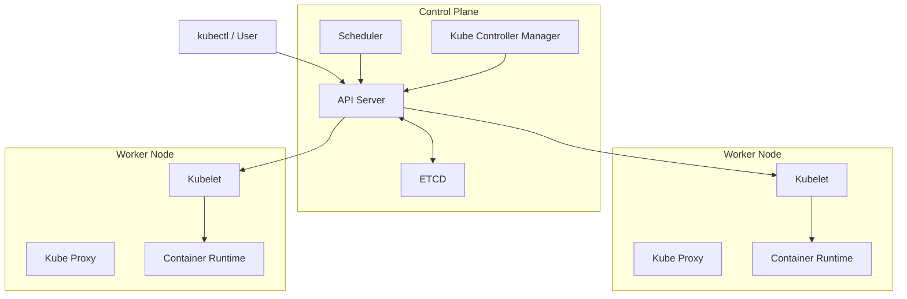

## Cluster: Master-Worker Architecture (ASCII)

In Kubernetes, a cluster is generally organized as:
- **Master (Control Plane):** Manages the cluster
- **Worker Nodes:** Run application Pods/containers

```text
                         +----------------------------------+
                         |          MASTER NODE             |
                         |         (Control Plane)          |
                         |----------------------------------|
                         | API Server                       |
                         | Scheduler                        |
                         | Controller Manager               |
                         | ETCD                             |
                         +----------------+-----------------+
                                          |
                                          | Cluster Control
                ---------------------------------------------------------
                |                                                       |
   +-------------v------------+                            +-------------v------------+
   |      WORKER NODE 1       |                            |      WORKER NODE 2       |
   |--------------------------|                            |--------------------------|
   | Kubelet                  |                            | Kubelet                  |
   | Kube Proxy               |                            | Kube Proxy               |
   | Container Runtime        |                            | Container Runtime        |
   | Pods (App Containers)    |                            | Pods (App Containers)    |
   +--------------------------+                            +--------------------------+
```

Flow:
1. User sends command through `kubectl` to API Server.
2. Scheduler selects a worker node for Pod.
3. Kubelet on that node starts containers via container runtime.
4. Kube Proxy manages network/service routing.

## Components of Master and Worker Node

## Master Node (Control Plane) Components
- `kube-apiserver`: Entry point of cluster (all commands/requests go here)
- `etcd`: Key-value store (cluster state source of truth)
- `kube-scheduler`: Decides on which worker node a Pod should run
- `kube-controller-manager`: Runs controllers to maintain desired state
- `cloud-controller-manager` (optional): Integrates with cloud provider APIs

## Worker Node Components
- `kubelet`: Node agent; ensures Pods are running
- `kube-proxy`: Handles service networking and traffic routing
- `container runtime` (`containerd`/`CRI-O`): Pulls images and runs containers
- `Pods`: Actual application workloads running on the node

## Master vs Worker (Quick Table)

| Master (Control Plane) | Worker Node |
| --- | --- |
| Manages cluster state | Runs app workloads |
| Schedules Pods | Executes Pods |
| Stores cluster data in ETCD | Runs kubelet + runtime |
| Exposes API server | Handles service networking via kube-proxy |

## Visual (ASCII)

```text
+----------------------------- MASTER / CONTROL PLANE -----------------------------+
| API Server | ETCD | Scheduler | Controller Manager | Cloud Controller (optional) |
+----------------------------------------------------------------------------------+
                                      |
                                      | Controls / Schedules
          -----------------------------------------------------------------
          |                                                               |
+------------------------- WORKER NODE 1 ----------------------+  +------------------------- WORKER NODE 2 ----------------------+
| Kubelet  | Kube Proxy | Container Runtime | Pods             |  | Kubelet | Kube Proxy | Container Runtime | Pods              |
+--------------------------------------------------------------+  +--------------------------------------------------------------+
```

## Pods

## What is a Pod?
A Pod is the smallest deployable unit in Kubernetes.
It can contain one or more containers that share:
- Network (same IP and ports)
- Storage volumes
- Lifecycle (created/terminated together)

## Important Points
- Usually one main container per Pod (best common pattern)
- Pods are ephemeral (if a Pod dies, Kubernetes creates a replacement)
- Pods are generally managed by `Deployment`, `StatefulSet`, etc.
- Multi-container Pod is used for sidecar/helper patterns

## Pod Lifecycle (Basic)
`Pending -> Running -> Succeeded / Failed`

## Pod Internal View
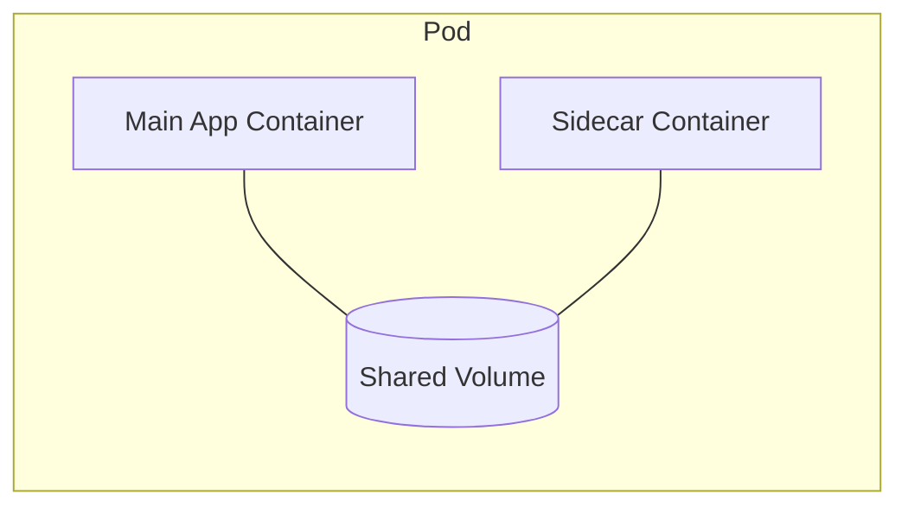

## Basic Pod YAML
```yaml
apiVersion: v1
kind: Pod
metadata:
  name: nginx-pod
  labels:
    app: nginx
spec:
  containers:
    - name: nginx
      image: nginx:latest
      ports:
        - containerPort: 80
```

## Useful Commands
```bash
kubectl get pods
kubectl describe pod nginx-pod
kubectl logs nginx-pod
kubectl delete pod nginx-pod
```

## Node and Pod

## What is a Node?
A Node is a machine (VM or physical server) in a Kubernetes cluster.
It provides CPU, memory, and storage to run Pods.

## What is a Pod?
A Pod is the smallest deployable unit in Kubernetes.
It contains one or more containers that run your application.

## Relation Between Node and Pod
- Node = infrastructure (where app runs)
- Pod = workload unit (what runs)
- A Node can run multiple Pods
- Kubernetes Scheduler decides on which Node a Pod should run

## Node and Pod Diagram
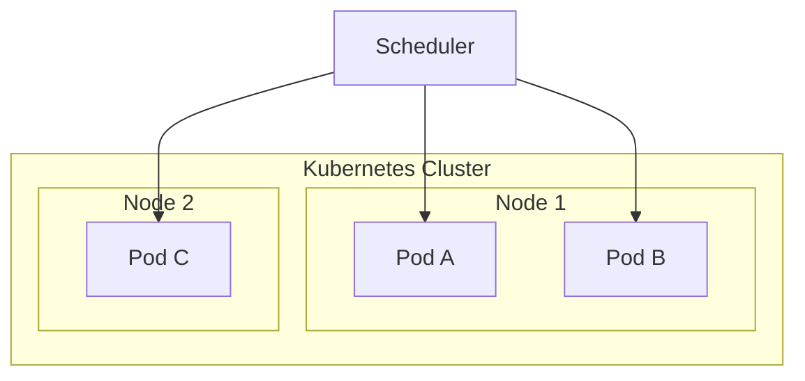

## Quick Comparison
| Node | Pod |
| --- | --- |
| Machine/VM in cluster | Smallest deployable app unit |
| Runs kubelet, kube-proxy, runtime | Runs app containers |
| Provides resources | Consumes node resources |

## Service and Ingress

## What is a Service?
A Service is a stable network endpoint in Kubernetes used to expose Pods.
Since Pod IPs are temporary, Service gives a fixed way to access Pods.

## Why Service is needed
- Pod IP changes when Pods restart
- Service provides stable DNS + virtual IP
- Load balances traffic to multiple Pod replicas

## Service Types
- `ClusterIP` (default): Internal access only inside cluster
- `NodePort`: Exposes service on each node IP at a static port
- `LoadBalancer`: Uses cloud load balancer for external access
- `ExternalName`: Maps service to an external DNS name


## Service YAML Example (ClusterIP)
```yaml
apiVersion: v1
kind: Service
metadata:
  name: app-service
spec:
  selector:
    app: my-app
  ports:
    - port: 80
      targetPort: 3000
  type: ClusterIP
```

## What is Ingress?
Ingress is an API object that manages external HTTP/HTTPS routing to Services.
It routes traffic based on domain/path rules.

## Ingress Features
- Host-based routing (`api.example.com`, `shop.example.com`)
- Path-based routing (`/api`, `/users`)
- TLS/SSL termination (HTTPS)
- Central entry point for multiple services


## Ingress YAML Example
```yaml
apiVersion: networking.k8s.io/v1
kind: Ingress
metadata:
  name: app-ingress
spec:
  rules:
    - host: myapp.example.com
      http:
        paths:
          - path: /
            pathType: Prefix
            backend:
              service:
                name: app-service
                port:
                  number: 80
```

## Service vs Ingress
| Service | Ingress |
| --- | --- |
| Exposes Pods | Exposes Services |
| L4 (TCP/UDP) networking concept | L7 (HTTP/HTTPS) routing concept |
| Stable internal endpoint | External routing + domain/path rules |

## Request Flow (Ingress + Service + Pods)
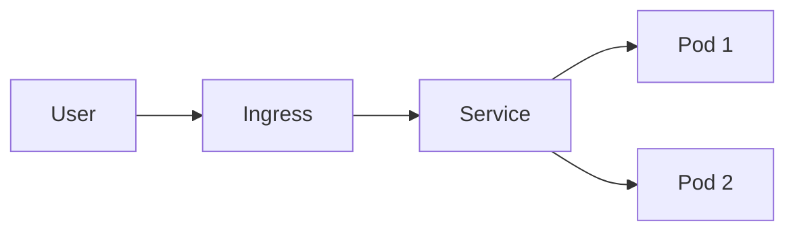

## Ephemeral in Kubernetes

`Ephemeral` means temporary (short-lived).
In Kubernetes, many resources are ephemeral by design.

## Ephemeral Pod
- A Pod can be created, replaced, or deleted at any time.
- If a node fails, Kubernetes recreates Pods on another node.
- Pod IP can change after restart/recreation.

## Ephemeral Storage
- Data stored inside container filesystem is temporary.
- If Pod is recreated, that local data is lost.
- For permanent data, use `PersistentVolume (PV)` and `PersistentVolumeClaim (PVC)`.

## Why this matters
- Never store critical data only inside container local storage.
- Design apps to be stateless when possible.
- Use external DB/object storage for durable state.

## Quick Example
If your app writes uploaded files to `/tmp` inside a Pod, those files may disappear after Pod restart.
Use persistent storage or external storage (S3, database, etc.) for long-term data.

## K8s Components: ConfigMap and Secrets

## ConfigMap
ConfigMap is used to store non-sensitive configuration data as key-value pairs.
Examples:
- App environment (`NODE_ENV=production`)
- Feature flags
- Config files

### ConfigMap Example
```yaml
apiVersion: v1
kind: ConfigMap
metadata:
  name: app-config
data:
  NODE_ENV: "production"
  APP_NAME: "k8s-demo"
```

## Secret
Secret is used to store sensitive data (like passwords, API keys, tokens).
Secret values are base64-encoded in YAML.

### Secret Example
```yaml
apiVersion: v1
kind: Secret
metadata:
  name: app-secret
type: Opaque
data:
  DB_PASSWORD: cGFzc3dvcmQxMjM=   # password123 (base64)
  API_KEY: bXktYXBpLWtleQ==      # my-api-key (base64)
```

## Use ConfigMap/Secret in Pod
```yaml
apiVersion: v1
kind: Pod
metadata:
  name: env-demo
spec:
  containers:
    - name: app
      image: nginx
      env:
        - name: NODE_ENV
          valueFrom:
            configMapKeyRef:
              name: app-config
              key: NODE_ENV
        - name: DB_PASSWORD
          valueFrom:
            secretKeyRef:
              name: app-secret
              key: DB_PASSWORD
```


## ConfigMap vs Secret
| ConfigMap | Secret |
| --- | --- |
| Non-sensitive data | Sensitive data |
| Plain text in YAML | Base64-encoded in YAML |
| Used for configs | Used for credentials/tokens |

## Useful Commands
```bash
kubectl get configmap
kubectl get secrets
kubectl describe configmap app-config
kubectl describe secret app-secret
```

## K8s Component: Volumes

## What is a Volume?
A Volume in Kubernetes provides storage to containers in a Pod.
Unlike container filesystem, volume data can survive container restart (within Pod lifecycle).

## Why Volumes are needed
- Share files between containers in same Pod
- Keep data outside container writable layer
- Persist important data using persistent storage

## Common Volume Types
- `emptyDir`: Temporary storage, created when Pod starts, removed when Pod is deleted
- `hostPath`: Mounts a path from node filesystem (mostly for testing/special cases)
- `configMap`: Mount ConfigMap data as files
- `secret`: Mount Secret data as files
- `persistentVolumeClaim (PVC)`: Attach persistent storage to Pod


## Example 1: `emptyDir` Volume
```yaml
apiVersion: v1
kind: Pod
metadata:
  name: volume-demo
spec:
  containers:
    - name: app
      image: nginx
      volumeMounts:
        - name: cache-vol
          mountPath: /cache
  volumes:
    - name: cache-vol
      emptyDir: {}
```

## Example 2: Persistent Volume Claim (PVC) in Pod
```yaml
apiVersion: v1
kind: Pod
metadata:
  name: pvc-demo
spec:
  containers:
    - name: app
      image: nginx
      volumeMounts:
        - name: app-storage
          mountPath: /data
  volumes:
    - name: app-storage
      persistentVolumeClaim:
        claimName: app-pvc
```

## PVC Example
```yaml
apiVersion: v1
kind: PersistentVolumeClaim
metadata:
  name: app-pvc
spec:
  accessModes:
    - ReadWriteOnce
  resources:
    requests:
      storage: 1Gi
```

## Useful Commands
```bash
kubectl get pv
kubectl get pvc
kubectl describe pvc app-pvc
```

## K8s Component: Deployment

## What is a Deployment?
Deployment is a Kubernetes object used to manage stateless application Pods.
It ensures the desired number of Pod replicas are running.

## Why use Deployment?
- Creates and manages ReplicaSets automatically
- Supports rolling updates with zero/minimal downtime
- Supports rollback to previous version
- Self-healing (recreates failed Pods)
- Easy scaling up/down

## How Deployment works
1. You define desired state (image, replicas, labels).
2. Deployment creates/updates a ReplicaSet.
3. ReplicaSet maintains required Pod count.
4. During update, Kubernetes performs rolling replacement.


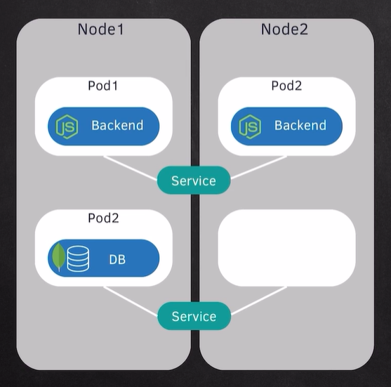
## Deployment YAML Example
```yaml
apiVersion: apps/v1
kind: Deployment
metadata:
  name: nginx-deployment
spec:
  replicas: 3
  selector:
    matchLabels:
      app: nginx
  template:
    metadata:
      labels:
        app: nginx
    spec:
      containers:
        - name: nginx
          image: nginx:1.25
          ports:
            - containerPort: 80
```

## Update Image (Rolling Update)
```bash
kubectl set image deployment/nginx-deployment nginx=nginx:1.26
```

## Rollback
```bash
kubectl rollout undo deployment/nginx-deployment
```

## Useful Commands
```bash
kubectl get deployments
kubectl describe deployment nginx-deployment
kubectl rollout status deployment/nginx-deployment
kubectl scale deployment nginx-deployment --replicas=5
```

## Service as LoadBalancer

## What is `type: LoadBalancer`?
`LoadBalancer` Service exposes your app externally by creating a cloud load balancer (on AWS/GCP/Azure).
It routes external traffic to your Kubernetes Service, then to Pods.

## Traffic Flow
`User -> External Load Balancer -> Kubernetes Service -> Pods`

## Diagram
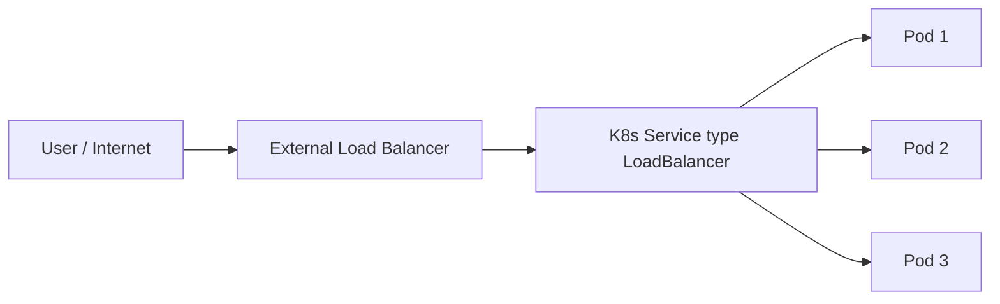

## LoadBalancer Service YAML
```yaml
apiVersion: v1
kind: Service
metadata:
  name: myapp-lb-service
spec:
  type: LoadBalancer
  selector:
    app: myapp
  ports:
    - protocol: TCP
      port: 80
      targetPort: 3000
```

## Important Notes
- Works directly in managed cloud Kubernetes environments.
- In local clusters (like Minikube/Kind), external LB may not be auto-provisioned.
- You can combine LoadBalancer with Ingress depending on architecture.

## Useful Commands
```bash
kubectl get svc
kubectl describe svc myapp-lb-service
```

## K8s Component: StatefulSet

## What is a StatefulSet?
StatefulSet is a Kubernetes workload object used for stateful applications.
It gives Pods:
- Stable identity (fixed Pod names like `db-0`, `db-1`)
- Stable network identity
- Stable persistent storage per Pod
- Ordered deployment, scaling, and termination

## When to use StatefulSet
- Databases (MySQL, PostgreSQL, MongoDB)
- Message brokers (Kafka, RabbitMQ clusters)
- Applications that need stable Pod identity/storage

## StatefulSet YAML Example
```yaml
apiVersion: apps/v1
kind: StatefulSet
metadata:
  name: web
spec:
  serviceName: "web"
  replicas: 2
  selector:
    matchLabels:
      app: web
  template:
    metadata:
      labels:
        app: web
    spec:
      containers:
        - name: nginx
          image: nginx:1.25
          ports:
            - containerPort: 80
          volumeMounts:
            - name: web-data
              mountPath: /usr/share/nginx/html
  volumeClaimTemplates:
    - metadata:
        name: web-data
      spec:
        accessModes: ["ReadWriteOnce"]
        resources:
          requests:
            storage: 1Gi
```

## Deployment vs StatefulSet

| Deployment | StatefulSet |
| --- | --- |
| Best for stateless apps | Best for stateful apps |
| Pod names are random/replaceable | Pod names are fixed and ordered (`app-0`, `app-1`) |
| No stable per-pod storage by default | Stable per-pod storage with `volumeClaimTemplates` |
| Pods created/updated in parallel (generally) | Ordered create/update/delete |
| Easy for web/API services | Used for DB/clustered stateful systems |

## Quick Rule
- Use `Deployment` for stateless apps (API, frontend, microservices).
- Use `StatefulSet` for stateful apps (DB, queues, clustered storage).

## Kubernetes Architecture: Master and Worker Node

Kubernetes cluster is split into:
- **Master (Control Plane):** Makes decisions and manages cluster state.
- **Worker Nodes:** Run application Pods.

### Master (Control Plane) does
- API handling (`kube-apiserver`)
- Scheduling (`kube-scheduler`)
- State reconciliation (`kube-controller-manager`)
- Cluster data storage (`etcd`)

### Worker Node does
- Runs Pods/containers
- Uses `kubelet` to communicate with control plane
- Uses `kube-proxy` for service networking
- Uses container runtime (`containerd`/`CRI-O`)

### Architecture Diagram


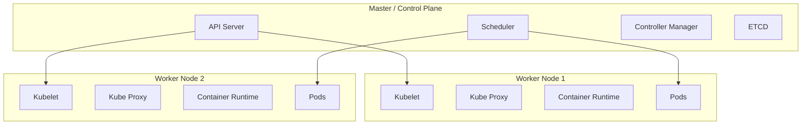
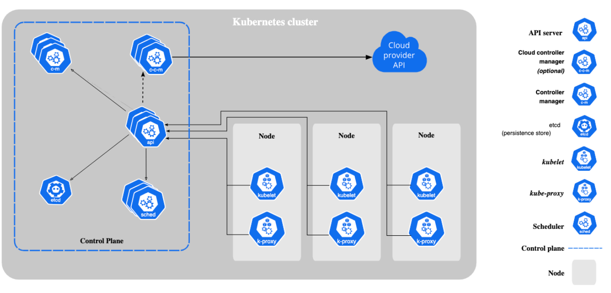

## Minikube and kubectl

## What is Minikube?
Minikube is a tool to run a local Kubernetes cluster (usually single-node) on your laptop/PC for learning and development.

## What is kubectl?
`kubectl` is the command-line tool used to interact with Kubernetes clusters.
It sends commands to the Kubernetes API server.

## Minikube vs kubectl
| Minikube | kubectl |
| --- | --- |
| Creates local Kubernetes cluster | Controls Kubernetes cluster |
| Local setup tool | Kubernetes CLI client |
| Used mostly for dev/practice | Used in dev + production |

## Basic Commands
```bash
# Start minikube cluster
minikube start

# Check cluster status
minikube status

# Check Kubernetes cluster info
kubectl cluster-info
kubectl get nodes
```

## Common kubectl Commands
```bash
kubectl get pods
kubectl get deployments
kubectl get services
kubectl describe pod <pod-name>
kubectl logs <pod-name>
kubectl apply -f <file.yaml>
kubectl delete -f <file.yaml>
```

## Useful Minikube Commands
```bash
minikube dashboard
minikube ip
minikube stop
minikube delete
```

## Quick Local Workflow
1. `minikube start`
2. `kubectl apply -f deployment.yaml`
3. `kubectl apply -f service.yaml`
4. `kubectl get pods,svc`
5. Access app and test

## Minikube Commands (Important)

## 1) Cluster Lifecycle
```bash
minikube start                  # Start local cluster
minikube stop                   # Stop cluster
minikube delete                 # Delete cluster
minikube status                 # Show cluster status
minikube pause                  # Pause Kubernetes
minikube unpause                # Resume Kubernetes
```

## 2) Cluster Info and Access
```bash
minikube ip                     # Get Minikube node IP
minikube ssh                    # SSH into minikube node
minikube dashboard              # Open Kubernetes dashboard
minikube kubectl -- get pods -A # Use built-in kubectl
```

## 3) Service and URL Access
```bash
minikube service <service-name>         # Open service in browser
minikube service <service-name> --url   # Print service URL
minikube tunnel                         # Enable LoadBalancer support locally
```

## 4) Addons
```bash
minikube addons list                    # List addons
minikube addons enable ingress          # Enable ingress addon
minikube addons disable ingress         # Disable ingress addon
```

## 5) Image and Cache
```bash
minikube image ls                       # List images in minikube
minikube image load myapp:latest        # Load local image into minikube
minikube cache add nginx:latest         # Cache image for faster startup
```

## 6) Config and Profiles
```bash
minikube profile list                   # Show profiles
minikube start -p demo                  # Start cluster with profile name 'demo'
minikube config set memory 4096         # Set default memory
minikube config set cpus 2              # Set default CPUs
```

## 7) Logs and Troubleshooting
```bash
minikube logs                           # Show minikube logs
minikube update-check                   # Check for updates
minikube doctor                         # Diagnose common problems
```

## Quick Tip
- For LoadBalancer services in Minikube, run `minikube tunnel` in a separate terminal.

## Commands Reference
- Detailed command cheat sheet: `Sigma 6.0/Kubernetes/COMMANDS.md`
