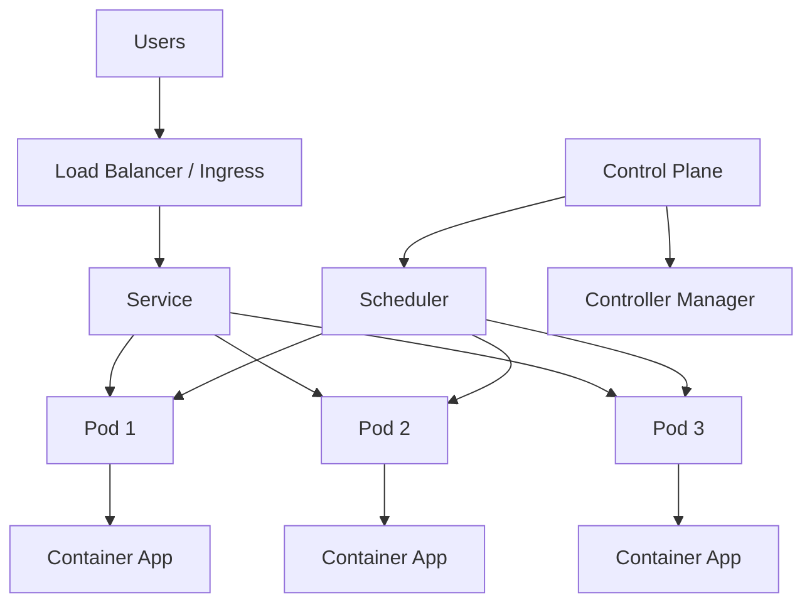
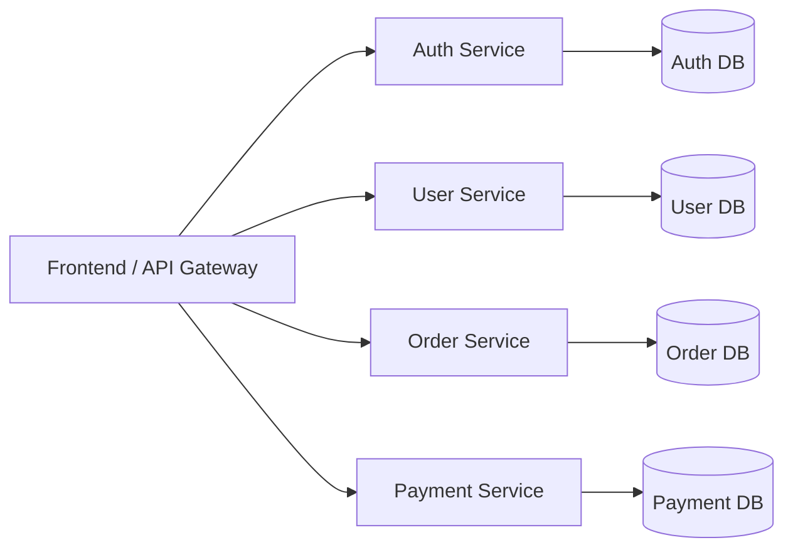
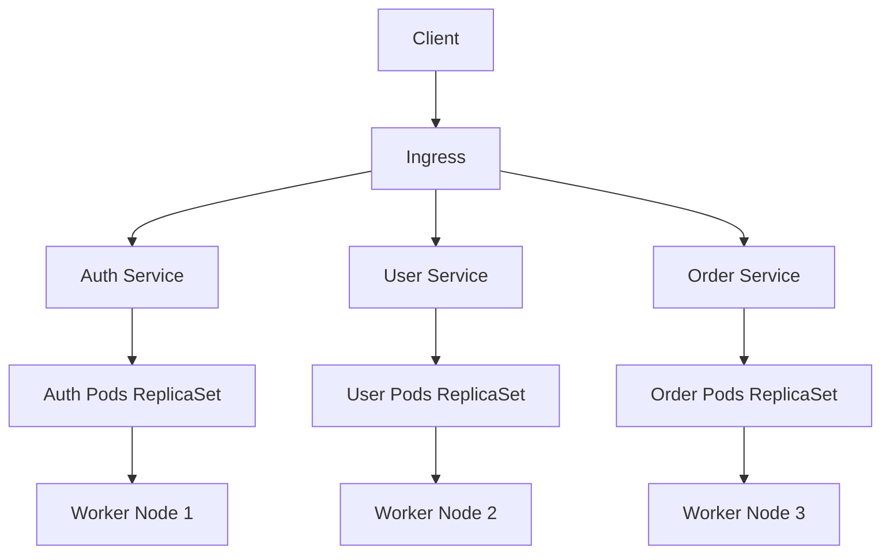
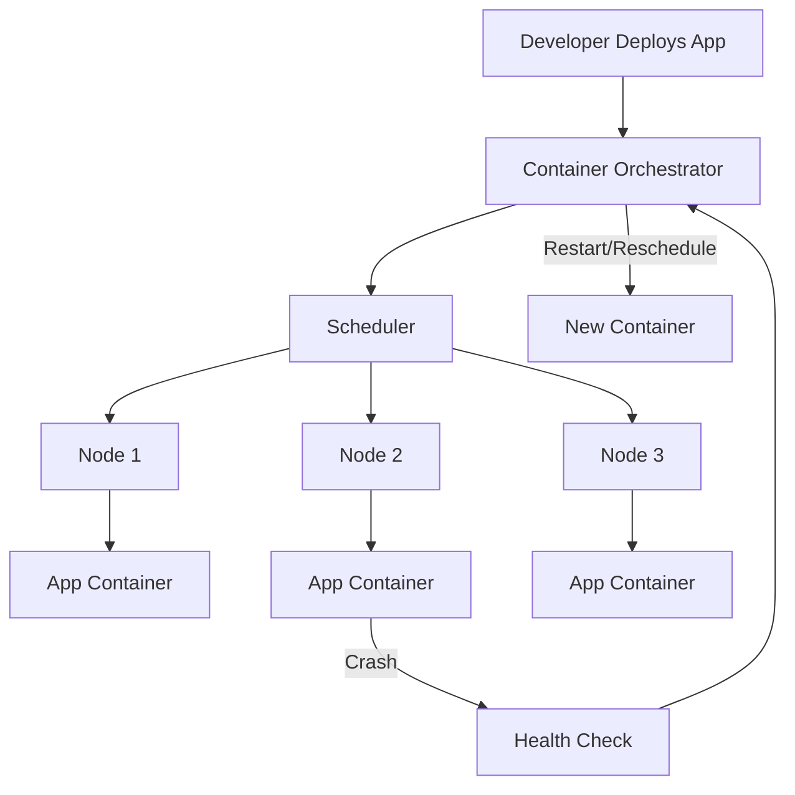
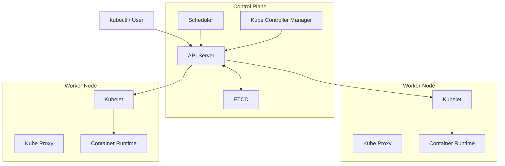
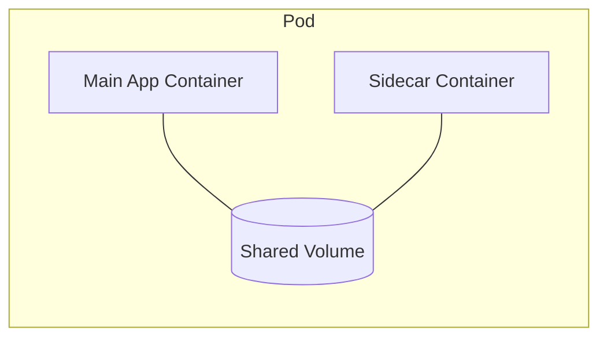
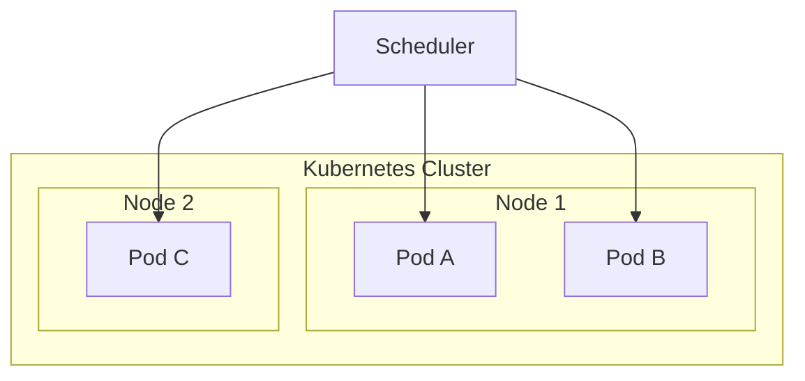
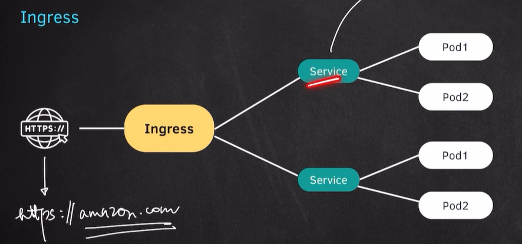
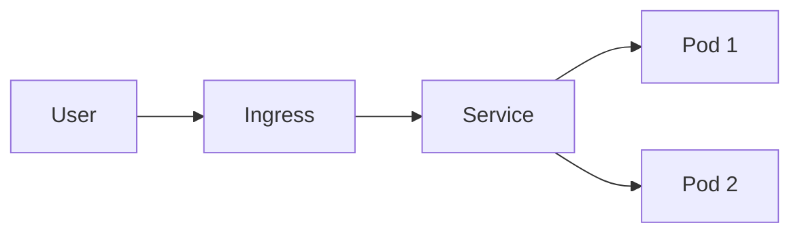
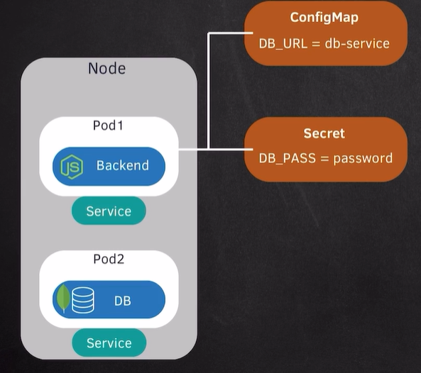

# Kubernetes and Microservices

## What is Kubernetes?
Kubernetes (K8s) is an open-source container orchestration platform.
It helps manage, deploy, scale, and monitor containerized applications automatically.

## Kubernetes at a Glance (Diagram)


## Why use Kubernetes?
- Automates deployment and scaling
- Self-healing (restarts failed containers)
- Load balances traffic across containers
- Supports rolling updates and rollbacks
- Works well in cloud and on-prem environments

## What are Microservices?
Microservices is an architecture style where an application is split into many small, independent services.
Each service handles one business function and can be developed, deployed, and scaled separately.

## Microservices Diagram


## Monolith vs Microservices (Quick View)
| Monolith | Microservices |
| --- | --- |
| Single large application | Many small services |
| One codebase/deployment | Separate services/deployments |
| Harder to scale specific parts | Scale each service independently |
| Tightly coupled | Loosely coupled |

## How Kubernetes and Microservices work together
Kubernetes is commonly used to run microservices in containers.
It manages service discovery, scaling, health checks, and deployment lifecycle for each service.

## Kubernetes + Microservices (Combined Diagram)


## Container Orchestration

Container orchestration means managing many containers automatically in production.
Instead of manually starting/stopping containers, an orchestrator handles deployment, scaling, networking, and recovery.

## Why it is needed
- Applications run in multiple containers
- Manual management becomes hard at scale
- Need high availability and auto-recovery
- Need rolling updates with minimal downtime

## Common Orchestration Tasks
- Scheduling containers on available servers
- Auto-scaling up/down based on load
- Service discovery and load balancing
- Self-healing (restart failed containers)
- Rolling updates and rollbacks
- Secret/config management

## Container Orchestration Diagram


## Kubernetes as an Orchestrator
Kubernetes is the most popular container orchestrator.
It ensures your desired state is maintained automatically.

## Components of Kubernetes (K8s)

## 1) API Server
- Entry point of Kubernetes control plane.
- Receives all requests from `kubectl`, UI, and internal components.
- Validates and processes cluster operations.

## 2) ETCD
- Distributed key-value store used by Kubernetes.
- Stores cluster state, configurations, and metadata.
- Source of truth for Kubernetes data.

## 3) Scheduler
- Decides which worker node should run a new Pod.
- Selects node based on resources, policies, and constraints.

## 4) Kube Controller Manager (Kube Controller)
- Runs controllers that continuously check desired state vs actual state.
- Examples: Node Controller, Replication Controller, Endpoint Controller.
- Ensures cluster self-healing and reconciliation.

## 5) Kubelet
- Agent running on every worker node.
- Communicates with API Server.
- Ensures Pod containers are running as defined.

## 6) Kube Proxy
- Network component on each node.
- Handles service networking and load balancing inside cluster.
- Maintains networking rules for Pod-to-Pod and Service traffic.

## 7) Container Runtime
- Software that actually runs containers.
- Examples: `containerd`, `CRI-O`.
- Kubelet uses runtime to pull images and start/stop containers.

## K8s Components Diagram


## Cluster: Master-Worker Architecture (ASCII)

In Kubernetes, a cluster is generally organized as:
- **Master (Control Plane):** Manages the cluster
- **Worker Nodes:** Run application Pods/containers

```text
                         +----------------------------------+
                         |          MASTER NODE             |
                         |         (Control Plane)          |
                         |----------------------------------|
                         | API Server                       |
                         | Scheduler                        |
                         | Controller Manager               |
                         | ETCD                             |
                         +----------------+-----------------+
                                          |
                                          | Cluster Control
                ---------------------------------------------------------
                |                                                       |
   +-------------v------------+                            +-------------v------------+
   |      WORKER NODE 1       |                            |      WORKER NODE 2       |
   |--------------------------|                            |--------------------------|
   | Kubelet                  |                            | Kubelet                  |
   | Kube Proxy               |                            | Kube Proxy               |
   | Container Runtime        |                            | Container Runtime        |
   | Pods (App Containers)    |                            | Pods (App Containers)    |
   +--------------------------+                            +--------------------------+
```

Flow:
1. User sends command through `kubectl` to API Server.
2. Scheduler selects a worker node for Pod.
3. Kubelet on that node starts containers via container runtime.
4. Kube Proxy manages network/service routing.

## Components of Master and Worker Node

## Master Node (Control Plane) Components
- `kube-apiserver`: Entry point of cluster (all commands/requests go here)
- `etcd`: Key-value store (cluster state source of truth)
- `kube-scheduler`: Decides on which worker node a Pod should run
- `kube-controller-manager`: Runs controllers to maintain desired state
- `cloud-controller-manager` (optional): Integrates with cloud provider APIs

## Worker Node Components
- `kubelet`: Node agent; ensures Pods are running
- `kube-proxy`: Handles service networking and traffic routing
- `container runtime` (`containerd`/`CRI-O`): Pulls images and runs containers
- `Pods`: Actual application workloads running on the node

## Master vs Worker (Quick Table)

| Master (Control Plane) | Worker Node |
| --- | --- |
| Manages cluster state | Runs app workloads |
| Schedules Pods | Executes Pods |
| Stores cluster data in ETCD | Runs kubelet + runtime |
| Exposes API server | Handles service networking via kube-proxy |

## Visual (ASCII)

```text
+----------------------------- MASTER / CONTROL PLANE -----------------------------+
| API Server | ETCD | Scheduler | Controller Manager | Cloud Controller (optional) |
+----------------------------------------------------------------------------------+
                                      |
                                      | Controls / Schedules
          -----------------------------------------------------------------
          |                                                               |
+------------------------- WORKER NODE 1 ----------------------+  +------------------------- WORKER NODE 2 ----------------------+
| Kubelet  | Kube Proxy | Container Runtime | Pods             |  | Kubelet | Kube Proxy | Container Runtime | Pods              |
+--------------------------------------------------------------+  +--------------------------------------------------------------+
```

## Pods

## What is a Pod?
A Pod is the smallest deployable unit in Kubernetes.
It can contain one or more containers that share:
- Network (same IP and ports)
- Storage volumes
- Lifecycle (created/terminated together)

## Important Points
- Usually one main container per Pod (best common pattern)
- Pods are ephemeral (if a Pod dies, Kubernetes creates a replacement)
- Pods are generally managed by `Deployment`, `StatefulSet`, etc.
- Multi-container Pod is used for sidecar/helper patterns

## Pod Lifecycle (Basic)
`Pending -> Running -> Succeeded / Failed`

## Pod Internal View


## Basic Pod YAML
```yaml
apiVersion: v1
kind: Pod
metadata:
  name: nginx-pod
  labels:
    app: nginx
spec:
  containers:
    - name: nginx
      image: nginx:latest
      ports:
        - containerPort: 80
```

## Useful Commands
```bash
kubectl get pods
kubectl describe pod nginx-pod
kubectl logs nginx-pod
kubectl delete pod nginx-pod
```

## Node and Pod

## What is a Node?
A Node is a machine (VM or physical server) in a Kubernetes cluster.
It provides CPU, memory, and storage to run Pods.

## What is a Pod?
A Pod is the smallest deployable unit in Kubernetes.
It contains one or more containers that run your application.

## Relation Between Node and Pod
- Node = infrastructure (where app runs)
- Pod = workload unit (what runs)
- A Node can run multiple Pods
- Kubernetes Scheduler decides on which Node a Pod should run

## Node and Pod Diagram


## Quick Comparison
| Node | Pod |
| --- | --- |
| Machine/VM in cluster | Smallest deployable app unit |
| Runs kubelet, kube-proxy, runtime | Runs app containers |
| Provides resources | Consumes node resources |

## Service and Ingress

## What is a Service?
A Service is a stable network endpoint in Kubernetes used to expose Pods.
Since Pod IPs are temporary, Service gives a fixed way to access Pods.

## Why Service is needed
- Pod IP changes when Pods restart
- Service provides stable DNS + virtual IP
- Load balances traffic to multiple Pod replicas

## Service Types
- `ClusterIP` (default): Internal access only inside cluster
- `NodePort`: Exposes service on each node IP at a static port
- `LoadBalancer`: Uses cloud load balancer for external access
- `ExternalName`: Maps service to an external DNS name


## Service YAML Example (ClusterIP)
```yaml
apiVersion: v1
kind: Service
metadata:
  name: app-service
spec:
  selector:
    app: my-app
  ports:
    - port: 80
      targetPort: 3000
  type: ClusterIP
```

## What is Ingress?
Ingress is an API object that manages external HTTP/HTTPS routing to Services.
It routes traffic based on domain/path rules.

## Ingress Features
- Host-based routing (`api.example.com`, `shop.example.com`)
- Path-based routing (`/api`, `/users`)
- TLS/SSL termination (HTTPS)
- Central entry point for multiple services




## Ingress YAML Example
```yaml
apiVersion: networking.k8s.io/v1
kind: Ingress
metadata:
  name: app-ingress
spec:
  rules:
    - host: myapp.example.com
      http:
        paths:
          - path: /
            pathType: Prefix
            backend:
              service:
                name: app-service
                port:
                  number: 80
```

## Service vs Ingress
| Service | Ingress |
| --- | --- |
| Exposes Pods | Exposes Services |
| L4 (TCP/UDP) networking concept | L7 (HTTP/HTTPS) routing concept |
| Stable internal endpoint | External routing + domain/path rules |

## Request Flow (Ingress + Service + Pods)


## Ephemeral in Kubernetes

`Ephemeral` means temporary (short-lived).
In Kubernetes, many resources are ephemeral by design.

## Ephemeral Pod
- A Pod can be created, replaced, or deleted at any time.
- If a node fails, Kubernetes recreates Pods on another node.
- Pod IP can change after restart/recreation.

## Ephemeral Storage
- Data stored inside container filesystem is temporary.
- If Pod is recreated, that local data is lost.
- For permanent data, use `PersistentVolume (PV)` and `PersistentVolumeClaim (PVC)`.

## Why this matters
- Never store critical data only inside container local storage.
- Design apps to be stateless when possible.
- Use external DB/object storage for durable state.

## Quick Example
If your app writes uploaded files to `/tmp` inside a Pod, those files may disappear after Pod restart.
Use persistent storage or external storage (S3, database, etc.) for long-term data.

## K8s Components: ConfigMap and Secrets

## ConfigMap
ConfigMap is used to store non-sensitive configuration data as key-value pairs.
Examples:
- App environment (`NODE_ENV=production`)
- Feature flags
- Config files

### ConfigMap Example
```yaml
apiVersion: v1
kind: ConfigMap
metadata:
  name: app-config
data:
  NODE_ENV: "production"
  APP_NAME: "k8s-demo"
```

## Secret
Secret is used to store sensitive data (like passwords, API keys, tokens).
Secret values are base64-encoded in YAML.

### Secret Example
```yaml
apiVersion: v1
kind: Secret
metadata:
  name: app-secret
type: Opaque
data:
  DB_PASSWORD: cGFzc3dvcmQxMjM=   # password123 (base64)
  API_KEY: bXktYXBpLWtleQ==      # my-api-key (base64)
```

## Use ConfigMap/Secret in Pod
```yaml
apiVersion: v1
kind: Pod
metadata:
  name: env-demo
spec:
  containers:
    - name: app
      image: nginx
      env:
        - name: NODE_ENV
          valueFrom:
            configMapKeyRef:
              name: app-config
              key: NODE_ENV
        - name: DB_PASSWORD
          valueFrom:
            secretKeyRef:
              name: app-secret
              key: DB_PASSWORD
```


## ConfigMap vs Secret
| ConfigMap | Secret |
| --- | --- |
| Non-sensitive data | Sensitive data |
| Plain text in YAML | Base64-encoded in YAML |
| Used for configs | Used for credentials/tokens |

## Useful Commands
```bash
kubectl get configmap
kubectl get secrets
kubectl describe configmap app-config
kubectl describe secret app-secret
```
    
