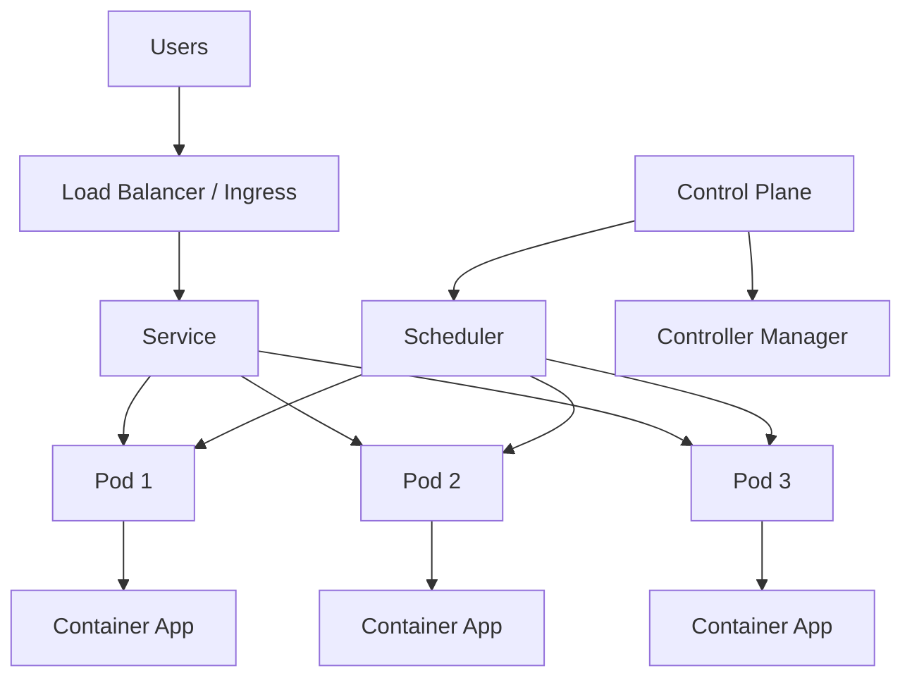
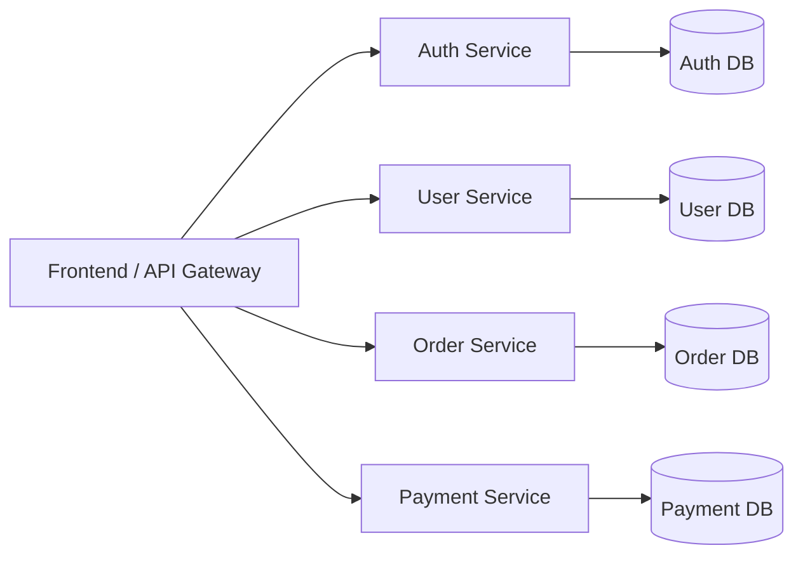
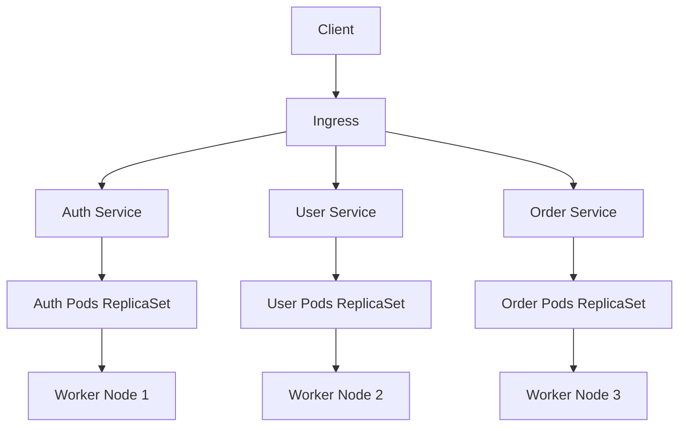

# Kubernetes and Microservices

## What is Kubernetes?
Kubernetes (K8s) is an open-source container orchestration platform.
It helps manage, deploy, scale, and monitor containerized applications automatically.

## Kubernetes at a Glance (Diagram)

## Why use Kubernetes?
- Automates deployment and scaling
- Self-healing (restarts failed containers)
- Load balances traffic across containers
- Supports rolling updates and rollbacks
- Works well in cloud and on-prem environments

## What are Microservices?
Microservices is an architecture style where an application is split into many small, independent services.
Each service handles one business function and can be developed, deployed, and scaled separately.

## Microservices Diagram

## Monolith vs Microservices (Quick View)
| Monolith | Microservices |
| --- | --- |
| Single large application | Many small services |
| One codebase/deployment | Separate services/deployments |
| Harder to scale specific parts | Scale each service independently |
| Tightly coupled | Loosely coupled |

## How Kubernetes and Microservices work together
Kubernetes is commonly used to run microservices in containers.
It manages service discovery, scaling, health checks, and deployment lifecycle for each service.

## Kubernetes + Microservices (Combined Diagram)

