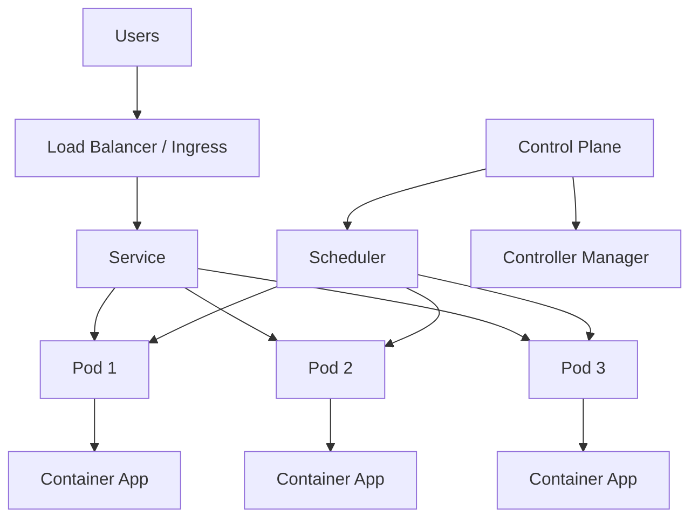
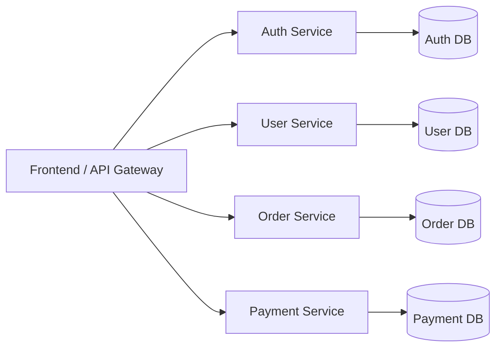
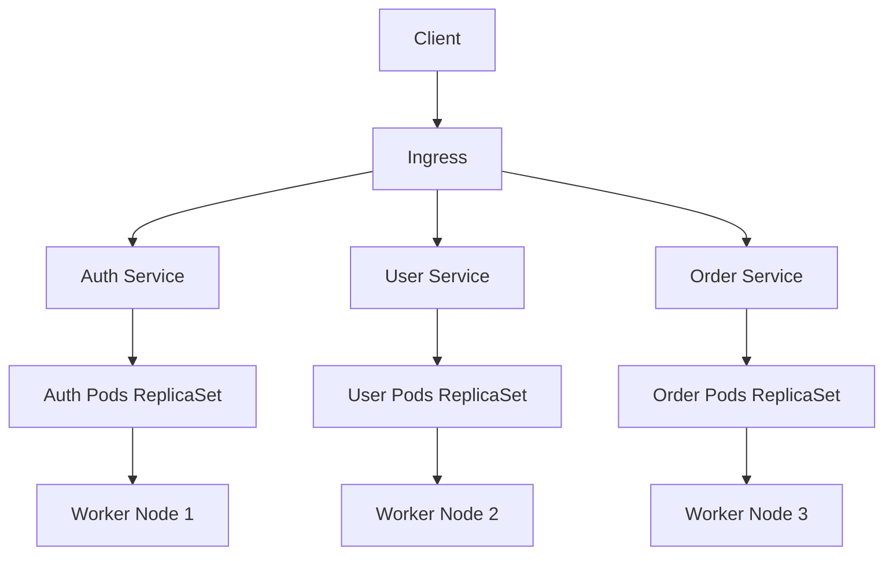
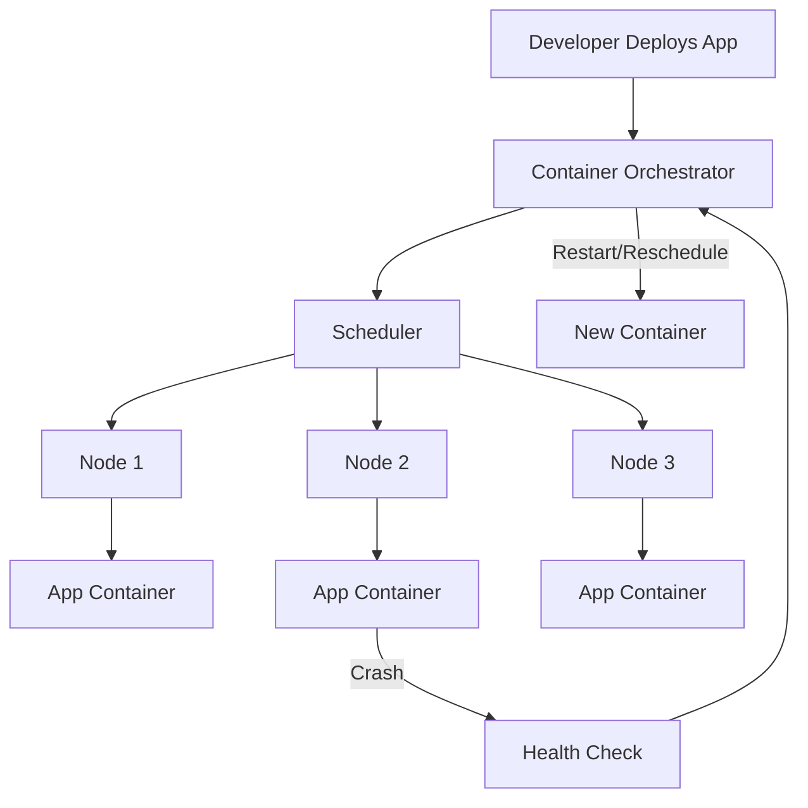
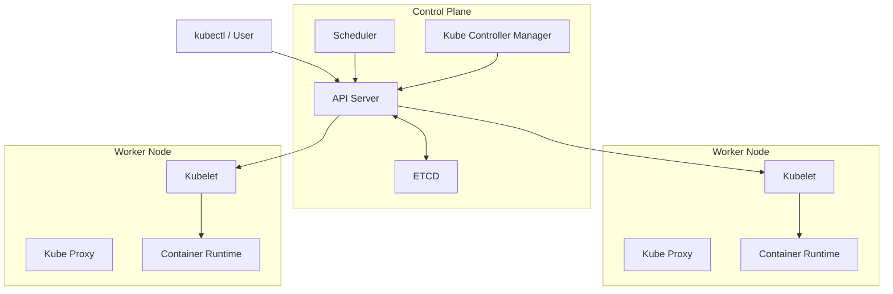

# Kubernetes and Microservices

## What is Kubernetes?
Kubernetes (K8s) is an open-source container orchestration platform.
It helps manage, deploy, scale, and monitor containerized applications automatically.

## Kubernetes at a Glance (Diagram)


## Why use Kubernetes?
- Automates deployment and scaling
- Self-healing (restarts failed containers)
- Load balances traffic across containers
- Supports rolling updates and rollbacks
- Works well in cloud and on-prem environments

## What are Microservices?
Microservices is an architecture style where an application is split into many small, independent services.
Each service handles one business function and can be developed, deployed, and scaled separately.

## Microservices Diagram


## Monolith vs Microservices (Quick View)
| Monolith | Microservices |
| --- | --- |
| Single large application | Many small services |
| One codebase/deployment | Separate services/deployments |
| Harder to scale specific parts | Scale each service independently |
| Tightly coupled | Loosely coupled |

## How Kubernetes and Microservices work together
Kubernetes is commonly used to run microservices in containers.
It manages service discovery, scaling, health checks, and deployment lifecycle for each service.

## Kubernetes + Microservices (Combined Diagram)


## Container Orchestration

Container orchestration means managing many containers automatically in production.
Instead of manually starting/stopping containers, an orchestrator handles deployment, scaling, networking, and recovery.

## Why it is needed
- Applications run in multiple containers
- Manual management becomes hard at scale
- Need high availability and auto-recovery
- Need rolling updates with minimal downtime

## Common Orchestration Tasks
- Scheduling containers on available servers
- Auto-scaling up/down based on load
- Service discovery and load balancing
- Self-healing (restart failed containers)
- Rolling updates and rollbacks
- Secret/config management

## Container Orchestration Diagram


## Kubernetes as an Orchestrator
Kubernetes is the most popular container orchestrator.
It ensures your desired state is maintained automatically.

## Components of Kubernetes (K8s)

## 1) API Server
- Entry point of Kubernetes control plane.
- Receives all requests from `kubectl`, UI, and internal components.
- Validates and processes cluster operations.

## 2) ETCD
- Distributed key-value store used by Kubernetes.
- Stores cluster state, configurations, and metadata.
- Source of truth for Kubernetes data.

## 3) Scheduler
- Decides which worker node should run a new Pod.
- Selects node based on resources, policies, and constraints.

## 4) Kube Controller Manager (Kube Controller)
- Runs controllers that continuously check desired state vs actual state.
- Examples: Node Controller, Replication Controller, Endpoint Controller.
- Ensures cluster self-healing and reconciliation.

## 5) Kubelet
- Agent running on every worker node.
- Communicates with API Server.
- Ensures Pod containers are running as defined.

## 6) Kube Proxy
- Network component on each node.
- Handles service networking and load balancing inside cluster.
- Maintains networking rules for Pod-to-Pod and Service traffic.

## 7) Container Runtime
- Software that actually runs containers.
- Examples: `containerd`, `CRI-O`.
- Kubelet uses runtime to pull images and start/stop containers.

## K8s Components Diagram


## Cluster: Master-Worker Architecture (ASCII)

In Kubernetes, a cluster is generally organized as:
- **Master (Control Plane):** Manages the cluster
- **Worker Nodes:** Run application Pods/containers

```text
                         +----------------------------------+
                         |          MASTER NODE             |
                         |         (Control Plane)          |
                         |----------------------------------|
                         | API Server                       |
                         | Scheduler                        |
                         | Controller Manager               |
                         | ETCD                             |
                         +----------------+-----------------+
                                          |
                                          | Cluster Control
                ---------------------------------------------------------
                |                                                       |
   +-------------v------------+                            +-------------v------------+
   |      WORKER NODE 1       |                            |      WORKER NODE 2       |
   |--------------------------|                            |--------------------------|
   | Kubelet                  |                            | Kubelet                  |
   | Kube Proxy               |                            | Kube Proxy               |
   | Container Runtime        |                            | Container Runtime        |
   | Pods (App Containers)    |                            | Pods (App Containers)    |
   +--------------------------+                            +--------------------------+
```

Flow:
1. User sends command through `kubectl` to API Server.
2. Scheduler selects a worker node for Pod.
3. Kubelet on that node starts containers via container runtime.
4. Kube Proxy manages network/service routing.
    
