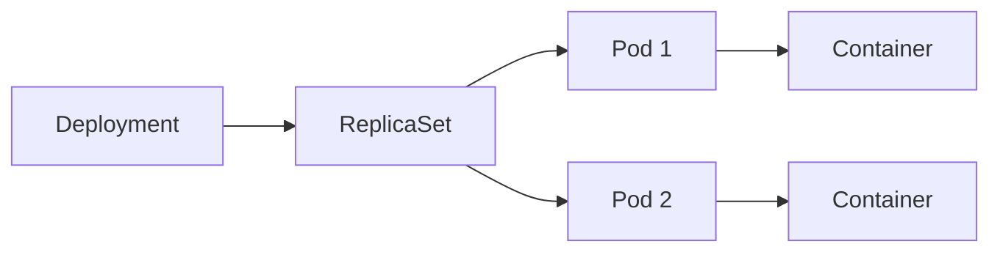

# YAML Guide for Kubernetes

## What is YAML?
YAML stands for **YAML Ain't Markup Language**.
It is a human-readable data format used to write configuration files.

## Why YAML is used in Kubernetes
Kubernetes uses YAML files (called **manifests**) to define resources like:
- Pods
- Deployments
- Services
- ConfigMaps
- Secrets
- Ingress

You describe the **desired state**, and Kubernetes tries to maintain that state.

## Purpose of YAML in K8s
- Declarative infrastructure/app configuration
- Version control friendly (store in Git)
- Easy repeatable deployments
- Better collaboration across teams

## Basic YAML Rules
- Use spaces for indentation (not tabs)
- Key-value format: `key: value`
- Lists use `-`
- Indentation level matters

Example:
```yaml
app:
  name: my-app
  ports:
    - 80
    - 443
```

## How to Write YAML (Step-by-Step)

Use this order while writing Kubernetes YAML:

1. `apiVersion`
2. `kind`
3. `metadata`
4. `spec`

Template:
```yaml
apiVersion: <group/version>
kind: <ResourceType>
metadata:
  name: <resource-name>
  labels:
    app: <label-name>
spec:
  # resource-specific fields here
```

### Writing Tips
- Keep indentation consistent (2 spaces commonly used).
- Every nested level should be properly aligned.
- Strings can be plain or quoted (`"value"`).
- Boolean values should be `true` / `false`.
- Numbers should not be quoted unless you need string type.

### Lists in YAML
```yaml
containers:
  - name: app
    image: nginx:latest
  - name: sidecar
    image: busybox
```

### Dictionary/Object in YAML
```yaml
metadata:
  name: my-app
  labels:
    app: my-app
    env: dev
```

### Full Small Example (Pod)
```yaml
apiVersion: v1
kind: Pod
metadata:
  name: nginx-pod
  labels:
    app: nginx
spec:
  containers:
    - name: nginx
      image: nginx:latest
      ports:
        - containerPort: 80
```

## Kubernetes YAML Main Fields

Most Kubernetes manifests contain:

```yaml
apiVersion: apps/v1
kind: Deployment
metadata:
  name: my-app
spec:
  replicas: 2
  selector:
    matchLabels:
      app: my-app
  template:
    metadata:
      labels:
        app: my-app
    spec:
      containers:
        - name: app
          image: nginx:latest
          ports:
            - containerPort: 80
```

Field meaning:
- `apiVersion`: Kubernetes API group/version
- `kind`: Resource type
- `metadata`: Name, labels, namespace info
- `spec`: Desired configuration

## Deployment Hierarchy Diagram

Kubernetes workload flow is usually:
`Deployment -> ReplicaSet -> Pods -> Containers`



## metadata vs spec vs status

In Kubernetes objects, these three sections have different roles:

## 1) `metadata`
`metadata` identifies and organizes the object.
It usually contains:
- `name`
- `namespace`
- `labels`
- `annotations`

Example:
```yaml
metadata:
  name: my-app
  namespace: default
  labels:
    app: my-app
```

## 2) `spec`
`spec` describes the **desired state** (what you want Kubernetes to run).

Example:
```yaml
spec:
  replicas: 3
  template:
    spec:
      containers:
        - name: app
          image: nginx:latest
```

## 3) `status`
`status` describes the **current/actual state** (what is happening right now in cluster).
This field is set by Kubernetes controllers, not usually written by you.

Example (runtime-generated):
```yaml
status:
  readyReplicas: 2
  availableReplicas: 2
  observedGeneration: 1
```

## Quick Difference
- `metadata` = object identity/info
- `spec` = desired state (user-defined)
- `status` = actual state (system-generated)

## Labels and Selectors

## What are Labels?
Labels are key-value pairs attached to Kubernetes objects.
They are used to identify, organize, and group resources.

- Notes: It is always defined under metadata.

Example labels:
```yaml
metadata:
  labels:
    app: my-app
    env: prod
    tier: backend
```

## What are Selectors?
Selectors are query conditions used to find matching resources by labels.
Controllers and Services use selectors to connect resources.


- Notes: It is always defined under specifications.

## Why Labels and Selectors are important
- Service finds target Pods using selectors
- Deployment/ReplicaSet manages matching Pods
- Easy filtering and grouping of resources
- Environment-based management (`dev`, `staging`, `prod`)

## Selector Types

## 1) Equality-based selector
Matches exact label value.

```yaml
selector:
  matchLabels:
    app: my-app
```

## 2) Set-based selector
Matches values using `in`, `notin`, `exists`.

```yaml
selector:
  matchExpressions:
    - key: env
      operator: In
      values: ["prod", "staging"]
```

## Service and Pod Matching Example

Pod:
```yaml
apiVersion: v1
kind: Pod
metadata:
  name: app-pod
  labels:
    app: my-app
spec:
  containers:
    - name: app
      image: nginx
```

Service:
```yaml
apiVersion: v1
kind: Service
metadata:
  name: app-service
spec:
  selector:
    app: my-app
  ports:
    - port: 80
      targetPort: 80
```

Meaning:
- Service will send traffic only to Pods where label `app: my-app` exists.

## Useful Commands
```bash
kubectl get pods --show-labels
kubectl get pods -l app=my-app
kubectl get all -l env=prod
```

## How YAML is used

Create/update resource:
```bash
kubectl apply -f deployment.yaml
```

Delete resource:
```bash
kubectl delete -f deployment.yaml
```

View as YAML:
```bash
kubectl get deployment my-app -o yaml
```

## Multi-Document YAML
You can define multiple resources in one file using `---`.

```yaml
apiVersion: v1
kind: ConfigMap
metadata:
  name: app-config
data:
  ENV: "prod"
---
apiVersion: v1
kind: Service
metadata:
  name: app-service
spec:
  selector:
    app: my-app
  ports:
    - port: 80
      targetPort: 3000
```

## Common Mistakes
- Wrong indentation
- Using tabs instead of spaces
- Wrong `apiVersion` for resource type
- Label selector mismatch (`Service` selector not matching Pod labels)
- Typo in field names

## Best Practices
- Keep one resource per file (or logically grouped)
- Use meaningful file names (`deployment.yaml`, `service.yaml`)
- Store manifests in Git
- Use labels consistently
- Validate before applying:

```bash
kubectl apply --dry-run=client -f file.yaml
```

## Quick Summary
- YAML is the main configuration language for Kubernetes.
- It defines what should run in the cluster.
- `kubectl apply -f` reads YAML and creates/updates resources.
