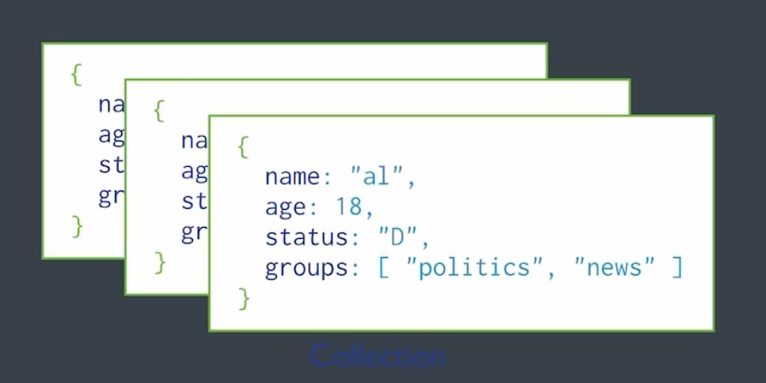
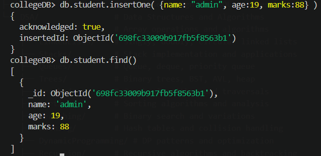
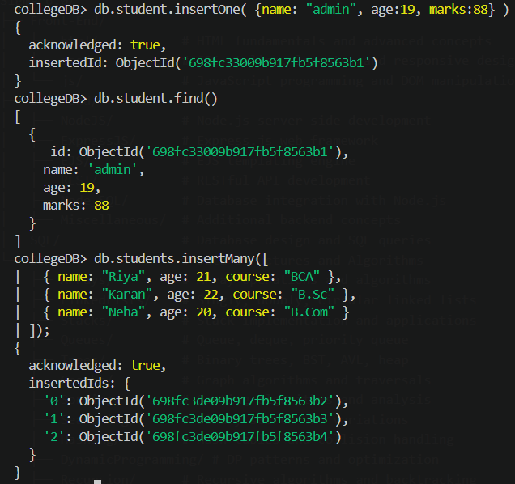
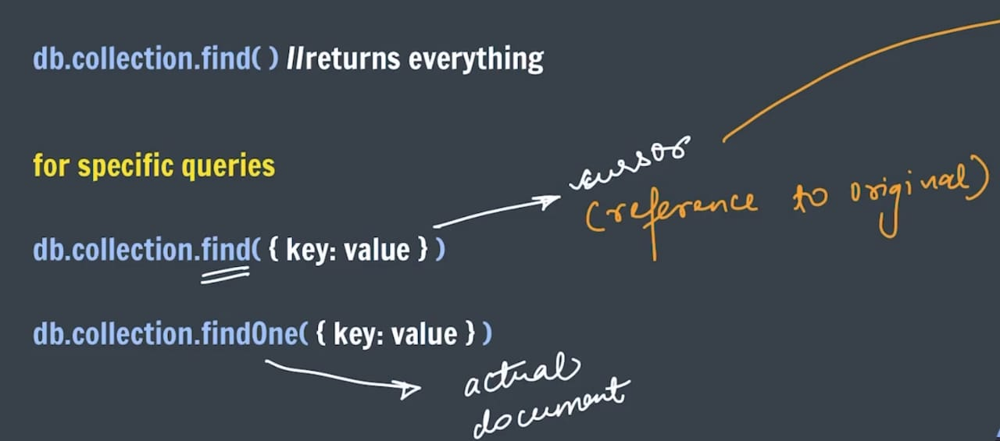
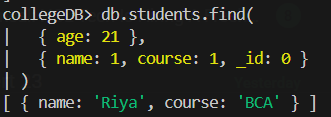
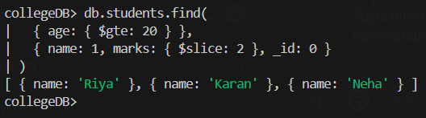

# MongoDB: What, Why, and Difference from MySQL

## What is MongoDB?
MongoDB is a NoSQL, document-oriented database.
It stores data in JSON-like documents (BSON) instead of rows and columns.

## Why use MongoDB?
- Flexible schema (easy to change data structure)
- Good for fast development and evolving apps
- Handles large-scale data and high traffic well
- Natural fit for nested/hierarchical data (like user profiles, carts, posts)

## MongoDB vs MySQL

| Feature | MongoDB | MySQL |
| --- | --- | --- |
| Database type | NoSQL (document) | SQL (relational) |
| Data format | Collections + Documents | Tables + Rows |
| Schema | Flexible / dynamic | Fixed / predefined |
| Relations | Embedded docs or references | Strong joins with foreign keys |
| Query language | MongoDB Query Language | SQL |
| Best for | Rapidly changing, semi-structured data | Structured data, complex relationships, transactions |

## Simple example
- MySQL: `users` table with columns (`id`, `name`, `email`)
- MongoDB: `users` collection with documents like:

```json
{
  "_id": "101",
  "name": "Aman",
  "email": "aman@mail.com",
  "address": {
    "city": "Delhi",
    "pin": "110001"
  }
}
```

## BSON and Difference from JSON

## What is BSON?
BSON stands for Binary JSON.
It is a binary-encoded format used by MongoDB to store documents internally.

## Why MongoDB uses BSON
- Faster parsing in many database operations
- Supports more data types than plain JSON
- Efficient for storage and traversal inside MongoDB

## BSON vs JSON

| Feature | BSON | JSON |
| --- | --- | --- |
| Full form | Binary JSON | JavaScript Object Notation |
| Format | Binary | Text |
| Readability | Not human-readable directly | Human-readable |
| Data types | More types (`Date`, `ObjectId`, `Binary`, `Decimal128`) | Limited basic types |
| Size | Can be larger in some cases (metadata/type info) | Usually smaller for simple text data |
| Use case | Internal DB storage and transfer in MongoDB | APIs, configs, data exchange |

## Example
JSON:
```json
{
  "name": "Aman",
  "age": 21
}
```

BSON (concept):
- Same logical data, but stored in binary format with explicit type information.

## Important Terms in MongoDB

- Database: A container that holds collections.
- Collection: A group of MongoDB documents (similar to a table in SQL).
- Document: A single record in MongoDB stored as key-value pairs (BSON/JSON-like).
- Field: A key in a document (similar to a column in SQL).
- `_id`: Unique identifier for each document. MongoDB creates it automatically if not provided.
- ObjectId: Default data type of `_id`; a 12-byte unique value.
- Schema: Structure of documents. MongoDB has a flexible schema (not strictly fixed).
- Embedded Document: A document stored inside another document.
- Array: A field that stores multiple values in one document.
- Query: A request to read/filter documents from a collection.
- Projection: Selecting specific fields to return in query results.
- Index: A data structure that improves query speed.
- CRUD: Basic operations: Create, Read, Update, Delete.
- Aggregation: Framework to process and transform data in stages (like pipelines).
- Replica Set: A group of MongoDB servers that maintain copies of data for high availability.
- Sharding: Splitting data across multiple servers for horizontal scaling.

## Collections and Documents

## Collection
A collection is a group of MongoDB documents.
It is similar to a table in MySQL, but without a strict fixed schema.

## Document
A document is a single record in MongoDB.
It stores data as key-value pairs (BSON format), similar to a JSON object.

## Collection vs Document

| Term | Meaning | SQL Equivalent |
| --- | --- | --- |
| Collection | Group of related records | Table |
| Document | One individual record | Row |
| Field | One key inside a document | Column |

## Example
Collection: `students`

Documents inside `students`:
```json
{
  "_id": "1",
  "name": "Aman",
  "age": 20,
  "course": "B.Tech"
}
```

```json
{
  "_id": "2",
  "name": "Riya",
  "age": 21,
  "skills": ["Java", "MongoDB"]
}
```

Note: Documents in the same collection can have different fields.



## Important Notes
- If `_id` is not provided, MongoDB creates it automatically.
- Collection is created automatically on first insert if it does not exist.
- Insert order in `insertMany()` is ordered by default.

## Show and Create Database (MongoDB)

## 1) Show all databases
Use:

```javascript
show dbs
```

This lists all available databases on the MongoDB server.

## 2) Create (or switch to) a database
Use:

```javascript
use collegeDB
db.students.insertOne({ name: "First User" })
```

- `use collegeDB` selects the database name.
- MongoDB actually creates `collegeDB` after first write operation (like `insertOne`).

## 3) Show current database
Use:

```javascript
db
```

This prints the currently selected database name.

## Insert in DB (MongoDB)

In MongoDB, data is inserted into a collection using insert operations.

## 1) Insert One Document
Use `insertOne()` to add a single document.

```javascript
db.students.insertOne({
  name: "Aman",
  age: 20,
  course: "B.Tech"
});
```

Result:
- One document is inserted.
- MongoDB returns `acknowledged: true` and an `insertedId`.



## 2) Insert Multiple Documents
Use `insertMany()` to add multiple documents at once.

```javascript
db.students.insertMany([
  { name: "Riya", age: 21, course: "BCA" },
  { name: "Karan", age: 22, course: "B.Sc" },
  { name: "Neha", age: 20, course: "B.Com" }
]);
```

Result:
- Multiple documents are inserted.
- MongoDB returns `acknowledged: true` and `insertedIds`.



## Find in DB (MongoDB)

In MongoDB, we use `find()` and `findOne()` to read documents from a collection.



## 1) Find all documents
Use:

```javascript
db.students.find()
```

This returns all documents in the `students` collection.

## 2) Find with condition (filter)
Use:

```javascript
db.students.find({ age: 21 })
```

This returns only documents where `age` is `21`.
- Note: It only gives reference to the original document.


## 3) Find one document
Use:

```javascript
db.students.findOne({ name: "Aman" })
```

This returns the first matching document.
- Note: It provides the actual document.


## 4) Find selected fields (projection)
Use:

```javascript
db.students.find(
  { age: 21 }, 
  { name: 1, course: 1, _id: 0 }
)
```

This returns only `name` and `course` fields.


## Common Query Operators
- `$gt`: greater than
- `$lt`: less than
- `$gte`: greater than or equal to
- `$lte`: less than or equal to
- `$ne`: not equal to
- `$in`: value matches any value in an array

Example:

```javascript
db.students.find({ age: { $gte: 20, $lte: 22 } })
```

This returns students whose age is between 20 and 22.

## Query Operators (MongoDB)

Query operators help filter documents based on conditions.

## 1) Comparison Operators
- `$eq`: equal to
- `$ne`: not equal to
- `$gt`: greater than
- `$gte`: greater than or equal to
- `$lt`: less than
- `$lte`: less than or equal to
- `$in`: matches any value in an array
- `$nin`: does not match values in an array

Examples:
```javascript
// $eq: equal to
db.students.find({ age: { $eq: 21 } })

// $ne: not equal to
db.students.find({ course: { $ne: "B.Tech" } })

// $gt: greater than
db.students.find({ age: { $gt: 20 } })

// $gte: greater than or equal to
db.students.find({ age: { $gte: 21 } })

// $lt: less than
db.students.find({ age: { $lt: 21 } })

// $lte: less than or equal to
db.students.find({ age: { $lte: 20 } })

// $in: matches any value in array
db.students.find({ course: { $in: ["B.Tech", "BCA"] } })

// $nin: does not match values in array
db.students.find({ course: { $nin: ["B.Tech", "BCA"] } })
```

## 2) Logical Operators
- `$and`: all conditions must be true
- `$or`: at least one condition must be true
- `$not`: negates a condition
- `$nor`: all conditions must be false

Examples:
```javascript
// $and: all conditions true
db.students.find({
  $and: [{ age: { $gte: 20 } }, { course: "B.Tech" }]
})

// $or: at least one condition true
db.students.find({
  $or: [{ course: "B.Tech" }, { age: { $lt: 20 } }]
})

// $not: negates a condition
db.students.find({
  age: { $not: { $gte: 21 } }
})

// $nor: all conditions false
db.students.find({
  $nor: [{ course: "B.Tech" }, { age: { $lt: 20 } }]
})
```

## 3) Element Operators
- `$exists`: checks whether a field exists
- `$type`: checks field data type

Example:
```javascript
db.students.find({ skills: { $exists: true } })
```

## 4) Evaluation Operators
- `$regex`: pattern matching in strings

Example:
```javascript
db.students.find({ name: { $regex: "^A" } })
```

This returns students whose names start with `A`.

## 5) Array Operators
- `$all`: array contains all specified elements
- `$elemMatch`: at least one array element matches multiple conditions
- `$size`: array length equals a value

Example:
```javascript
db.students.find({ skills: { $all: ["Java", "MongoDB"] } })
db.students.find({ marks: { $elemMatch: { $gte: 80, $lt: 90 } } })
db.students.find({ skills: { $size: 2 } })
```

## 6) Bitwise Operators
- `$bitsAllSet`: all specified bits are 1
- `$bitsAnySet`: at least one specified bit is 1
- `$bitsAllClear`: all specified bits are 0
- `$bitsAnyClear`: at least one specified bit is 0

Example:
```javascript
db.flags.find({ permissions: { $bitsAllSet: [1, 3] } })
```

## 7) Geospatial Operators
- `$near`: finds points near a location
- `$nearSphere`: spherical version of near
- `$geoWithin`: points/shapes inside an area
- `$geoIntersects`: geometry intersects another geometry

Example:
```javascript
db.places.find({
  location: {
    $near: {
      $geometry: { type: "Point", coordinates: [77.1025, 28.7041] },
      $maxDistance: 5000
    }
  }
})
```

Note: Geospatial queries usually require a `2dsphere` index on the location field.

## 8) Projection Operators
- `$`: positional projection (returns first matching array element)
- `$elemMatch`: projects first array element matching condition
- `$slice`: returns limited array elements
- `$meta`: projects metadata (like text score)

Example:
```javascript
db.students.find(
  { marks: { $gte: 80 } },
  { name: 1, marks: { $slice: 2 }, _id: 0 }
)
```


## Update in DB (MongoDB)

MongoDB provides different update operations depending on whether you want to update one document, many documents, or fully replace a document.

## 1) `updateOne()`
Updates only the first matching document.

```javascript
db.students.updateOne(
  { name: "Aman" },
  { $set: { age: 21 } }
)
```

## 2) `updateMany()`
Updates all documents that match the filter.

```javascript
db.students.updateMany(
  { course: "BCA" },
  { $set: { course: "BCA (Updated)" } }
)
```

## 3) `replaceOne()`
Replaces the entire document except `_id`.

```javascript
db.students.replaceOne(
  { name: "Riya" },
  { name: "Riya", age: 22, course: "BCA", city: "Delhi" }
)
```

## 4) Upsert (`updateOne`/`updateMany` with `upsert: true`)
If a document is not found, MongoDB inserts a new one.

```javascript
db.students.updateOne(
  { name: "Neha" },
  { $set: { age: 20, course: "B.Com" } },
  { upsert: true }
)
```

## Update Operators

## 1) Field Update Operators
- `$set`: set value of a field
- `$unset`: remove a field
- `$rename`: rename field
- `$currentDate`: set current date/time
- `$setOnInsert`: set fields only when upsert inserts a new document

```javascript
db.students.updateOne({ name: "Aman" }, { $set: { city: "Mumbai" } })
db.students.updateOne({ name: "Aman" }, { $unset: { city: "" } })
db.students.updateOne({ name: "Aman" }, { $rename: { course: "program" } })
db.students.updateOne({ name: "Aman" }, { $currentDate: { updatedAt: true } })
db.students.updateOne(
  { name: "New Student" },
  { $setOnInsert: { createdBy: "admin" } },
  { upsert: true }
)
```

## 2) Numeric Update Operators
- `$inc`: increase/decrease number
- `$mul`: multiply number
- `$min`: update only if new value is smaller
- `$max`: update only if new value is bigger

```javascript
db.students.updateOne({ name: "Aman" }, { $inc: { age: 1 } })
db.students.updateOne({ name: "Aman" }, { $mul: { age: 2 } })
db.students.updateOne({ name: "Aman" }, { $min: { age: 18 } })
db.students.updateOne({ name: "Aman" }, { $max: { age: 25 } })
```

## 3) Array Update Operators
- `$push`: add one value to array
- `$addToSet`: add value only if not already in array
- `$pull`: remove matching values from array
- `$pullAll`: remove all listed values
- `$pop`: remove first or last element (`-1` first, `1` last)

```javascript
db.students.updateOne({ name: "Aman" }, { $push: { skills: "MongoDB" } })
db.students.updateOne({ name: "Aman" }, { $addToSet: { skills: "MongoDB" } })
db.students.updateOne({ name: "Aman" }, { $pull: { skills: "MongoDB" } })
db.students.updateOne({ name: "Aman" }, { $pullAll: { skills: ["C", "C++"] } })
db.students.updateOne({ name: "Aman" }, { $pop: { skills: 1 } })
```

## 4) `$push` Modifiers
- `$each`: push multiple values
- `$position`: insert at a specific index
- `$slice`: keep limited array length
- `$sort`: sort array elements

```javascript
db.students.updateOne(
  { name: "Aman" },
  {
    $push: {
      marks: {
        $each: [82, 90, 76],
        $sort: -1,
        $slice: 3
      }
    }
  }
)
```

## Replace in MongoDB

Replace operations overwrite the whole document (except `_id`).
Use them when you want to swap the entire document structure.

## 1) `replaceOne()`
Replaces the first matching document.

```javascript
db.students.replaceOne(
  { name: "Riya" },
  { name: "Riya", age: 22, course: "BCA", city: "Delhi" }
)
```

Important:
- Fields not included in replacement are removed.
- `_id` remains the same.

## 2) `findOneAndReplace()`
Replaces one document and can return old/new document.

```javascript
db.students.findOneAndReplace(
  { name: "Karan" },
  { name: "Karan", age: 23, course: "B.Sc", city: "Pune" },
  { returnDocument: "after" }
)
```

## 3) Replace with upsert
If no document matches, insert a new one.

```javascript
db.students.replaceOne(
  { name: "New User" },
  { name: "New User", age: 20, course: "B.Com" },
  { upsert: true }
)
```

## Aggregation Stages

These are commonly used stages in MongoDB aggregation pipelines.

## 1) `$addFields`
Adds new fields to documents (keeps existing fields).

```javascript
db.students.aggregate([
  {
    $addFields: {
      isAdult: { $gte: ["$age", 18] }
    }
  }
])
```

## 2) `$set`
Same as `$addFields` (alias).

```javascript
db.students.aggregate([
  {
    $set: {
      fullInfo: { $concat: ["$name", " - ", "$course"] }
    }
  }
])
```

## 3) `$project`
Selects, reshapes, or computes output fields.

```javascript
db.students.aggregate([
  {
    $project: {
      _id: 0,
      name: 1,
      course: 1,
      ageIn5Years: { $add: ["$age", 5] }
    }
  }
])
```

## 4) `$unset`
Removes fields from documents.

```javascript
db.students.aggregate([
  {
    $unset: ["age", "marks"]
  }
])
```

## 5) `$replaceRoot`
Replaces the whole document with another embedded document.

```javascript
db.students.aggregate([
  {
    $replaceRoot: { newRoot: "$profile" }
  }
])
```

## 6) `$replaceWith`
Same purpose as `$replaceRoot` (newer concise form).

```javascript
db.students.aggregate([
  {
    $replaceWith: "$profile"
  }
])
```

Note:
- `$set` = `$addFields`
- `$replaceWith` = `$replaceRoot` with `newRoot`
